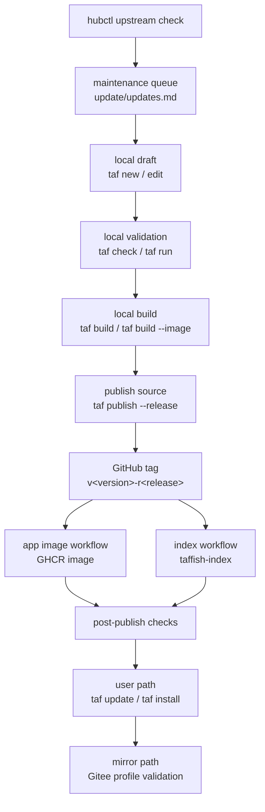

# App Release Lifecycle

This document records the complete lifecycle of a TAFFISH app: creation, validation, build, release, indexing, mirroring, user-side verification, and later maintenance. It describes how maintainers and automations cooperate. It does not replace the `taf publish` implementation, the app project specification, the index schema, or the container runtime specification.

The core goal is that every app version has a clear identity:

```text
package version  ->  0.1.0
package release  ->  1
version id       ->  0.1.0-r1
git tag          ->  v0.1.0-r1
container image  ->  ghcr.io/taffish/<app>:0.1.0-r1
command artifact ->  taf-<app>-v0.1.0-r1
```

## Related Documents

| Document | Focus |
| --- | --- |
| [GitHub Organization Architecture](github-organization.md) | Repository, organization, Gitee mirror, and permission topology. |
| [Automation Pipeline Architecture](automation-pipelines.md) | Automation boundaries for app images, index, Web Hub, Gitee mirror, and hubctl. |
| [taffish-hub Architecture](taffish-hub-architecture.md) | App staging, update queue, and archives in the maintainer-side local factory. |
| [TAFFISH Project Specification](../../standards/en/taffish-project-spec.md) | `taffish.toml`, directory layout, `docs/help.md`, and app project contract. |
| [Hub Index Specification](../../standards/en/hub-index-spec.md) | Machine-readable index records after an app is published. |

This document connects those pieces into a "what happens when" lifecycle.

## Lifecycle States

An app version can be understood through these states:

| State | Representative artifact | Notes |
| --- | --- | --- |
| Draft | local app worktree | The app is still being edited and is not installable by users. |
| Validated | `taf check` passes | Metadata, main `.taf`, help docs, dependencies, and container declarations satisfy the basic contract. |
| Built | `target/` artifacts | Local command wrapper exists; containerized apps may also have a local image. |
| Source published | GitHub commit, tag, Release | Canonical source ref exists and can be indexed. |
| Image published | GHCR image | OCI image for a containerized app is pushed and should be public. |
| Indexed | `taffish-index/index/*.json` | Users can discover the version after `taf update`. |
| Mirrored | Gitee source/index mirror | China-profile users can read the index and clone source through mirrors. |
| Install verified | local `taf install` succeeds | The user path is verified from discovery to install to command execution. |
| Maintained | `hubctl` / new release | Future upstream updates, packaging fixes, and doc changes. |
| Archived | `apps-archive/` snapshot | Maintainer-side snapshot of a published version. |

Not all states are advanced by one command. TAFFISH intentionally separates local validation, GitHub publishing, GHCR build, index scanning, and mirror sync so failures can be handled locally.

## Overall Flow



## Phase 1: Create An App Draft

An app is usually created with `taf new`:

```sh
taf new my-tool --tool --docker
```

or, for a flow:

```sh
taf new my-flow --flow
```

Typical structure:

```text
my-tool/
  taffish.toml
  src/main.taf
  docs/help.md
  README.md
  LICENSE
  release.md
  docker/Dockerfile
  .github/workflows/build-image.yml
```

`release.md` is a local release draft and is ignored by `.gitignore`. It is not app source, but `taf publish --release` reads it.

Check immediately:

1. `[package].name` is the final package name and should not churn.
2. `[repository].url` points to the GitHub canonical repository, not Gitee or an internal mirror.
3. `[command].name` starts with `taf-`.
4. Public Hub apps should include `[meta]` for discovery and categorization.
5. Tool apps should include `[upstream]` whenever possible: original software, version, upstream open-source license, citation/DOI/PMID, and source.
6. Flow apps should declare taf-app dependencies explicitly rather than hiding scientific dependencies in prose.

## Phase 2: Complete Metadata And Scientific Context

Publishing an app is not just adding a `.taf` file to a repository. Maintainers should prepare:

| Content | Location | Purpose |
| --- | --- | --- |
| app identity | `[package]` | Determines version id, tag, index record, and install target. |
| canonical repository | `[repository].url` | Source identity recorded in the index. |
| command entry | `[command]` / `src/main.taf` | Determines installed command name. |
| runtime semantics | `[runtime]` | Determines pipe support, command mode, and related behavior. |
| discovery metadata | `[meta]` | Records domain, category, summary, and search keywords. |
| container declaration | `[container]` | Determines image, Dockerfile, and build platforms. |
| platform constraints | `[platform]` | Records OS, arch, container requirement, and resource needs. |
| upstream source | `[upstream]` | Records original bioinformatics software, version, homepage, release page, existing upstream image, paper attribution, and upstream open-source license. |
| help docs | `docs/help.md` | Helps `taf check`, Hub, and users understand the app. |
| release notes | `release.md` | Provides publish message and GitHub Release notes. |

`[meta]` is discovery metadata. It helps Hub/index search and display, but local commands should not require it.

`[upstream]` is especially important for tool wrappers. It is not only display
metadata; it supports future `hubctl` upstream version checks and makes the
upstream license and academic attribution visible to index consumers.
`[upstream].license` is distinct from `[package].license`: the former belongs
to the wrapped upstream project, while the latter belongs to the TAFFISH
wrapper. For scholarly tools, prefer verified `citation`, `doi`, and `pmid`
fields instead of burying paper information only in prose. Apps without
upstream metadata can still be published, but maintenance costs are higher.

## Phase 3: Local Validation

Before publishing, the project must pass:

```sh
taf check
```

`taf check` is not a scientific-result test. It verifies the TAFFISH ecosystem contract:

1. Required `taffish.toml` fields exist and have valid types.
2. `[repository].url` is a canonical GitHub URL.
3. `[package].version` and `[package].release` form a valid version id.
4. `[package].main` points to an existing `.taf` file.
5. `docs/help.md` exists.
6. `[command].name` is valid.
7. A containerized app's `[container].image` tag matches the version id.
8. The main `.taf` file references the same container image.
9. A containerized app declares valid `[smoke]` metadata.
10. Flow dependencies match actual references.

Maintainers should also run a minimal local smoke test:

```sh
taf run -- --help
```

or run the smallest real input case. `taf check` does not replace scientific validity checks.

## Phase 4: Local Build

Normal build:

```sh
taf build
```

Typical artifacts:

```text
target/taf-<app>-v<version>-r<release>
target/.taf-<app>-v<version>-r<release>/
```

The built command uses a frozen source snapshot instead of reading the current `src/` live. This makes local verification closer to what users will install.

For a containerized app that needs a local image test:

```sh
taf build --image --backend docker
```

or build command and image together:

```sh
taf build --all --backend docker
```

Important: `taf publish --release --yes --build` currently builds the command wrapper before publishing. It does not build and push the GHCR image. Remote image publishing is handed off to the app repository's GitHub Actions workflow.

## Phase 5: Pre-Publish Dry Run

Edit `release.md` first. Its first line must be a real release summary and must not keep the default `# TODO: release summary` placeholder. The whole file becomes GitHub Release notes.

Run:

```sh
taf publish --release --dry-run
```

The dry run should confirm:

1. Target repository is correct.
2. Target tag is `v<version>-r<release>`.
3. Remote does not already have the same tag.
4. The latest-release policy allows the current version.
5. GitHub Release will be created if requested.
6. Planned git/gh commands are expected.

If the remote repository does not exist, create it manually first or publish with:

```sh
taf publish --release --yes --build --create-repo --public
```

Early official Hub apps should be public. Private apps may be useful for internal tests but should not enter the public index.

## Phase 6: Publish Canonical Source

Publish:

```sh
taf publish --release --yes --build
```

The publish flow:

1. Runs `taf check`.
2. Checks `LICENSE`, rejecting empty or placeholder license files.
3. Reads `[repository].url`.
4. Checks remote tags.
5. Checks latest/pre policy.
6. Reads `release.md` for commit message and GitHub Release notes.
7. Builds command wrapper when requested.
8. Runs `git add -A`.
9. Removes `release.md` from the git index when release notes are used.
10. Commits current project changes.
11. Creates tag `v<version>-r<release>`.
12. Pushes branch and tag.
13. Creates GitHub Release.

`taf publish` does not handle GitHub login. Maintainers should configure SSH keys, a git credential helper, or GitHub CLI auth beforehand.

`taf publish` also does not synchronize Gitee. Gitee is a read/install mirror, not a canonical publish target.

## Phase 7: Publish Container Image

If the app has a Dockerfile, tag push triggers:

```text
.github/workflows/build-image.yml
```

The workflow reads `[container]` from `taffish.toml`:

```toml
[container]
image = "ghcr.io/taffish/my-tool:0.1.0-r1"
dockerfile = "docker/Dockerfile"
build_platforms = "linux/amd64,linux/arm64"
```

After the image is published, verify:

1. Workflow succeeded.
2. GHCR package belongs to the `taffish` organization.
3. GHCR package visibility is public.
4. Image tag exists.
5. Image tag matches `taffish.toml` and `.taf` container tag.
6. Target runtime machines can reach the registry.

If image build fails, do not mutate the published tag. Fix Dockerfile or packaging, increment `release`, and publish a new tag such as `0.1.0-r2`.

## Phase 8: Enter The Index

After app source is published, `taffish-index` workflow scans GitHub `taffish`:

```text
taffish-index/.github/workflows/build-index.yml
```

It prioritizes release tags instead of default branches. A repository is indexed when it usually satisfies:

1. Root `taffish.toml` exists.
2. Required fields are valid.
3. `[repository].url` points to the scanned GitHub repository.
4. `[package].main` exists.
5. `docs/help.md` exists.
6. Release tag uses `v<version>-r<release>`.
7. Container, dependency, and platform fields are parseable by the index builder.
8. Release source commit can be recorded as `source.commit`.
9. Containerized apps can pass declared `[smoke]` checks and produce digest/platform metadata.

Successful index workflow commits generated files:

```text
index/index.json
index/packages/<package>.json
index/commands/<command>.json
```

For user-side supply-chain tracing, the important result is not only that the
package appears in the index. The index should also carry the source commit,
container digest/platform metadata, and smoke status when those are applicable.

If an app is missing from the index, inspect index workflow warnings first, then app repository discovery rules.

## Phase 9: User-Path Verification

Publishing does not end when a GitHub tag exists. It ends when users can install through the index.

Verify in a clean environment or isolated TAFFISH home:

```sh
taf update
taf search my-tool
taf info my-tool
taf install --dry-run my-tool
taf install my-tool
taf which taf-my-tool
taf-my-tool -- --help
taf-my-tool-v0.1.0-r1 -- --help
```

The goal is not "the local worktree runs". The goal is "the user can discover
from index, install from source ref/commit, pass install-side source commit
verification when `source.commit` exists, and run the installed command".

For flow apps, verify dependencies install automatically:

```sh
taf install my-flow
taf list
```

For containerized apps, verify backend and registry availability:

```sh
taf-my-tool -- --help
```

If a specific development backend must be forced, return to the app worktree and use `taf run --backend docker -- --help`; installed commands should run according to their compiled container tag and runtime rules.

## Phase 10: Gitee And China Mirror Verification

Gitee organization:

```text
taffish-org
```

The mirror side should sync:

1. `taffish/taffish`.
2. `taffish/taffish-index`.
3. The corresponding app repository.
4. The corresponding release tag.

China profile changes access paths through config:

```toml
[index]
url = "https://gitee.com/taffish-org/taffish-index/raw/main/index/index.json"

[[source.rewrite]]
from = "https://github.com/taffish/"
to = "https://gitee.com/taffish-org/"
enabled = true
```

Verification:

```sh
taf config init --china --force
taf update
taf install my-tool
```

Gitee mirror does not change index schema, package identity, or canonical source. It only lets users download index and clone source from mirror URLs.

Container images are separate. The China profile does not automatically rewrite GHCR to another registry. Containerized apps still require the runtime machine to pull the declared OCI image.

## Phase 11: Archive And Maintain

In `taffish-hub`, published app snapshots can be copied manually to:

```text
apps-archive/
```

The archive does not replace Git tags. It is a maintainer-side snapshot for comparison, migration, and batch review.

`hubctl` handles upstream checks:

```sh
hubctl/target/hubctl check --all
```

It writes pending work to:

```text
update/updates.md
```

After a maintainer migrates, tests, publishes, and archives one app update, they can mark it done from inside that app project:

```sh
hubctl/target/hubctl check --finish
```

`hubctl` does not edit apps, build images, or publish. It is only a maintenance queue.

## Version Advancement Rules

Increment `release` when:

1. TAFFISH wrapper logic is fixed.
2. Dockerfile is fixed.
3. `docs/help.md` is fixed.
4. `taffish.toml` metadata is fixed.
5. Upstream software version stays the same but packaging changes.
6. GHCR image must be republished without overwriting old tags.

Increment `version` when:

1. Upstream software version changes.
2. A flow's main scientific process or default behavior changes.
3. User-visible app semantics change.
4. Users should explicitly choose new behavior instead of getting a transparent replacement.

Do not overwrite published tags. Publish a new `release` for fixes.

## Failure Recovery Principles

| Failure point | Handling |
| --- | --- |
| `taf check` fails | Fix local project and recheck; do not publish. |
| dry-run shows wrong repo/tag | Fix `taffish.toml` or publish args before creating tags. |
| `taf publish` fails before push | Fix local git state and rerun. |
| tag pushed but GitHub Release failed | Do not change tag; add GitHub Release manually or publish a new release. |
| GHCR build fails | Fix Dockerfile/metadata, increment `release`, and publish again. |
| GHCR package is not public | Change package visibility; app source does not need to change. |
| index missing app | Check index workflow warnings, fix metadata, publish a new release. |
| Gitee mirror lags | Sync mirror; do not change canonical index. |
| user install fails | Separate index download, source clone, build, container pull, and runtime failures. |

The most important rule: public Git tags and image tags are immutable. Fixes advance `release`; they do not overwrite history.

## Pre-Release Checklist

- [ ] `name`, `version`, `release`, and `repository.url` in `taffish.toml` are correct.
- [ ] `command.name` starts with `taf-`.
- [ ] `src/main.taf` can be parsed by `taf check`.
- [ ] `docs/help.md` is updated.
- [ ] `LICENSE` is neither empty nor a placeholder template.
- [ ] `[meta]` is present for public Hub discovery if this app is intended for the official index.
- [ ] `[upstream]` is present if wrapping third-party bioinformatics software, including upstream license and citation/DOI/PMID when known.
- [ ] For containerized apps, `[container].image` tag equals `<version>-r<release>`.
- [ ] For containerized apps, `[smoke]` declares minimal executable and/or command checks.
- [ ] For containerized apps, local `taf build --image --backend ...` and `taf run --backend ...` use consistent backends.
- [ ] For flow apps, dependencies match actual references.
- [ ] `taf run` or the minimal real use case passes.
- [ ] `taf build` or `taf build --all` passes.
- [ ] `release.md` first line and release notes are ready.
- [ ] `taf publish --release --dry-run` output is expected.

## Post-Release Checklist

- [ ] GitHub repository exists under `taffish/<app>`.
- [ ] Git tag `v<version>-r<release>` exists.
- [ ] GitHub Release notes are correct.
- [ ] For containerized apps, `build-image.yml` succeeded.
- [ ] For containerized apps, GHCR package is public.
- [ ] For containerized apps, index automation recorded digest/platform metadata and smoke status.
- [ ] Index record includes `source.commit` for the release tag.
- [ ] `taffish-index` workflow succeeded.
- [ ] `index/index.json` contains the package/version.
- [ ] `taffish.github.io` displays the app.
- [ ] After `taf update`, `taf search` / `taf info` work.
- [ ] `taf install --dry-run <app>` output is expected.
- [ ] `taf install <app>` installs a runnable command.
- [ ] `taf which <app>` / `taf list --json` show source commit metadata when present.
- [ ] Gitee mirror is synchronized.
- [ ] China profile `taf update` / `taf install` works.
