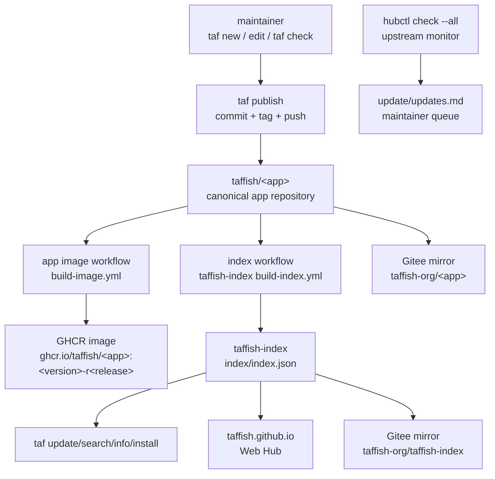

# Automation Pipeline Architecture

This document records how the main TAFFISH ecosystem automations are divided: app repositories build container images, `taffish-index` scans the organization and generates static index files, Web Hub displays the index, Gitee acts only as a repository mirror and access-optimization layer, and `hubctl` monitors upstream versions for maintainers.

This is a system-flow document. It does not replace concrete workflow files, the `taffish.toml` specification, or the index schema.

## Current State

From the current TAFFISH implementation and the sibling `taffish-hub` workspace, automation status can be grouped as follows:

| Category | Current state | Notes |
| --- | --- | --- |
| app image workflow | TAFFISH can generate it | `taf new --docker` generates `.github/workflows/build-image.yml`; each app repository runs its own workflow. |
| index generation workflow | implemented in `taffish-index` | `.github/workflows/build-index.yml` supports manual and daily scheduled scans of the `taffish` organization. |
| maintainer upstream checks | implemented as a local `taffish-hub` tool | `hubctl check --all` writes `update/updates.md` and only reports upstream version changes. |

The current `taffish-hub` README states that only upstream detection is automated for now; app migration, testing, Docker image builds, publishing, and archive snapshots remain manual maintainer work. In other words, the ecosystem architecture is clear, but migration-time docs must distinguish "designed to be automated" from "already fully automated".

## Overall Data Flow



Core rule: each automation owns its own artifact and should not mutate other layers.

## Automation 1: App Image Publishing

App image publishing belongs to each taf-app repository. It does not belong to `taffish-index` or `taffish.github.io`.

Typical layout:

```text
taffish/<app>/
  taffish.toml
  docker/Dockerfile
  .github/workflows/build-image.yml
```

The current `taf new --docker` generates this workflow. It:

1. Runs on tag push `v*` or manual `workflow_dispatch`.
2. Checks out the app repository.
3. Reads `taffish.toml` with Python `tomllib`.
4. Reads `[container].image`, `[container].dockerfile`, `[container].build_platforms`, and optional `[smoke]`.
5. Logs in to GHCR.
6. Builds and pushes architecture-specific images with Docker Buildx.
7. Publishes the final manifest with `docker buildx imagetools create`.

The current template always builds `linux/amd64`; if `build_platforms` contains `linux/arm64`, it attempts arm64 as well. arm64 build failure is allowed, in which case an amd64-only manifest is published.

The image workflow may run repository-local smoke checks, but the canonical
accept/reject decision for the public package index belongs to the index
builder, because it can inspect the final published image digest/platform set.

Required permissions:

```yaml
permissions:
  contents: read
  packages: write
```

Image tags should match TAFFISH version ids:

```text
ghcr.io/taffish/<app>:<version>-r<release>
```

The app workflow should not:

1. Edit `taffish-index` by hand.
2. Generate the global index.
3. Synchronize Gitee.
4. Overwrite published tags.
5. Use `latest` as a formal app reference.

If TAFFISH later adds "trigger index rebuild after app publish", the trigger should run after the image workflow succeeds, not immediately after tag push. Otherwise the index may record a containerized app before its GHCR image has been built or made public.

## Automation 2: Index Scanning And Generation

`taffish-index` is the static index repository. Its workflow lives at:

```text
taffish-index/.github/workflows/build-index.yml
```

Current triggers:

```yaml
on:
  workflow_dispatch:
    inputs:
      include_default_branch:
        type: boolean
        default: false
  schedule:
    - cron: "17 1 * * *"
```

It runs manually or daily. Current workflow settings:

```yaml
permissions:
  contents: write

concurrency:
  group: taffish-index
  cancel-in-progress: false
```

Core command:

```sh
sbcl --script scripts/build-index.lisp -- --org "taffish" --output index
```

The workflow:

1. Checks out `taffish-index`.
2. Installs SBCL.
3. Scans the `taffish` GitHub organization.
4. Reads each candidate app repository's `taffish.toml`, `docs/help.md`, and release tags.
5. Generates `index/index.json`, `index/packages/<package>.json`, and `index/commands/<command>.json`.
6. Commits and pushes `index/` if it changed.

Token order:

```text
TAFFISH_BOT_TOKEN -> preferred
GITHUB_TOKEN      -> fallback
```

The index builder discovers, validates, and records app metadata. It does not
build images and does not publish app releases. It can write `[container].image`,
image digest/platform metadata, and `[smoke]` results into the index, but the
image itself must be published by the app repository workflow.

For release-tag records, the index builder should also record the resolved
source commit as `source.commit`. `taf install` uses that field to verify the
resolved source before building the installed command, so mirrors and source
rewrite do not weaken source traceability.

By default, the index should prioritize release tags. Default-branch snapshots are for development/debugging and should be enabled explicitly through manual `include_default_branch`.

## Automation 3: Web Hub Display

`taffish.github.io` is the presentation layer. It consumes static JSON from `taffish-index` and provides search, filters, detail views, and install commands.

If the Web Hub is a static frontend that fetches:

```text
https://raw.githubusercontent.com/taffish/taffish-index/main/index/index.json
```

then index updates do not necessarily require redeploying the website. The website reads the latest index at runtime.

If the Web Hub later becomes a static pre-rendered site, a third GitHub Action can:

1. Trigger after `taffish-index` updates.
2. Check out `taffish.github.io`.
3. Read the index.
4. Generate static pages.
5. Deploy GitHub Pages.

Even if this pipeline fails, it should not break `taf update` or `taf install`, because the CLI's machine-readable entry point is `taffish-index`, not the website.

## Automation 4: Gitee Mirror Sync

Gitee organization:

```text
taffish-org
```

It is an access and install optimization layer for users in China, not the canonical publishing source. Mirror sync can be done manually, by Gitee mirror features, or by a separate GitHub Actions pipeline. The principles stay the same:

1. GitHub `taffish` remains canonical.
2. Gitee `taffish-org` mirrors repositories, tags, and index files.
3. Index source records should not be rewritten to Gitee.
4. User-side `[index].url` and `[[source.rewrite]]` change access paths.
5. `taf publish` still targets GitHub only.

Typical China profile:

```toml
[index]
url = "https://gitee.com/taffish-org/taffish-index/raw/main/index/index.json"

[[source.rewrite]]
from = "https://github.com/taffish/"
to = "https://gitee.com/taffish-org/"
enabled = true
```

GitHub Actions workflow files may be mirrored to Gitee, but that does not mean Gitee will execute them with GitHub Actions semantics. The mirror layer is a distribution path, not a second canonical CI/CD layer.

Container registries are separate. `source.rewrite` rewrites app repository clone URLs only; it does not automatically rewrite `ghcr.io/taffish/<app>`. If some users cannot reach GHCR, the app must publish or declare an image source those users can access, or TAFFISH must later add container-image rewrite support.

## Maintainer Automation: hubctl

`hubctl` is a maintainer-side tool in `taffish-hub`. It is not the user CLI and not an app repository workflow.

See [taffish-hub Architecture](taffish-hub-architecture.md) for the full workspace layout and maintainer data flow.

For now it does one automated job:

```sh
hubctl/target/hubctl check --all
```

It scans taf-apps under `repos/apps/`, reads `[upstream]`, checks upstream GitHub tags with `git ls-remote`, and writes pending work to:

```text
update/updates.md
```

`hubctl` explicitly does not:

1. Edit taf-app projects.
2. Build Docker images.
3. Publish GitHub repositories.
4. Create app releases.
5. Archive release snapshots.

Upstream version discovery can be semi-automated, but migration, parameter review, license checks, citation metadata, image builds, and reproducibility tests still need maintainer judgment.

## Recommended Trigger Matrix

| Automation | Repository | Trigger | Writes | Failure impact |
| --- | --- | --- | --- | --- |
| app image build | `taffish/<app>` | tag push `v*` / manual | GHCR package | Affects that app's container runtime. |
| index build | `taffish/taffish-index` | daily / manual | `index/` JSON | Affects app discovery/search/install metadata freshness. |
| Web Hub deploy | `taffish.github.io` | optional index update / manual | GitHub Pages | Affects website display only. |
| Gitee mirror sync | mirror pipeline | scheduled / manual | `gitee.com/taffish-org/*` | Affects China mirror path only. |
| upstream check | local `taffish-hub` | scheduled / manual | `update/updates.md` | Affects maintainer update queue only. |

## Why Split Automations

The split is for responsibility isolation:

1. App image builds can be slow, costly, and sensitive to upstream build failures; they should not block the global index.
2. Index generation should be lightweight, repeatable, and manually rerunnable; it should not own all app build permissions.
3. Web Hub is presentation; failures should not break CLI use.
4. Gitee mirrors optimize access paths and must not change canonical metadata.
5. Upstream checks are maintainer reminders and should not auto-upgrade scientific software.

This design also lets early single-maintainer work scale to multiple maintainers: each app can have its own maintainer while `taffish-index` and organization governance remain under core maintainers.

## Suggested Release Order

For a containerized app:

1. Finish local `taf check`, `taf build --all`, and required scientific checks.
2. Run `taf publish --release --dry-run`.
3. Run `taf publish --release --yes --build`.
4. Wait for the app repository `build-image.yml`, then confirm GHCR package is public.
5. Manually run or wait for `taffish-index` `build-index.yml`; containerized apps should pass declared `[smoke]`.
6. Verify user-side install with `taf update` and `taf install <app>`.
7. Sync Gitee mirror and verify `taf update` / `taf install` under the China profile.

If faster visibility is needed later, an app workflow can trigger `taffish-index` rebuild after step 4 succeeds. This should be an optional event-driven optimization, not a replacement for daily scans.

For the full app state model, manual checkpoints, and failure recovery, see [App Release Lifecycle](app-release-lifecycle.md).

## Maintenance Checklist

When changing the automation system, check:

1. `taf new --docker` generated workflow still reads `[container]`.
2. App image tags still equal `<version>-r<release>`.
3. `taf publish` still creates `v<version>-r<release>` tags.
4. `taffish-index` still scans GitHub `taffish`.
5. `taffish-index` still writes static JSON only and does not build images.
6. Gitee mirrors preserve canonical GitHub identity.
7. `hubctl` remains upstream detection and maintainer queue unless explicitly extended.
