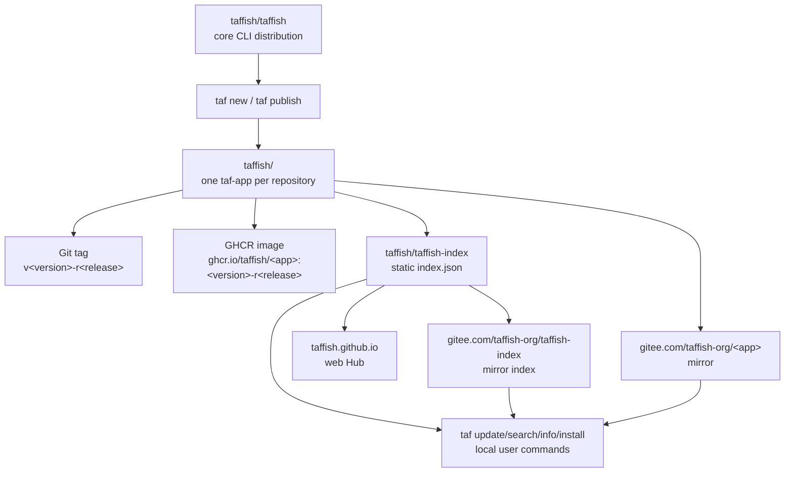

# GitHub Organization Architecture

This document records the TAFFISH GitHub organization structure, repository responsibilities, release flow, and Gitee mirror relationship. It describes ecosystem topology. It does not replace the field-level specifications for `taffish.toml`, Hub index, or install metadata. For GitHub Actions, index jobs, GHCR publishing, and Gitee synchronization, see [Automation Pipeline Architecture](automation-pipelines.md). For the lifecycle of a single app from creation to user-installable state, see [App Release Lifecycle](app-release-lifecycle.md). For the maintainer-side local factory, see [taffish-hub Architecture](taffish-hub-architecture.md).

## Core Principles

TAFFISH's canonical ecosystem identity is on GitHub:

```text
GitHub organization: taffish
```

The China access mirror is on Gitee:

```text
Gitee organization: taffish-org
```

These two names must not be mixed. GitHub `taffish` is the canonical identity; Gitee `taffish-org` is a mirror and access-optimization layer.

## Top-Level Topology



## Repository Types In The Organization

### Core Repositories

| Repository | Role | Notes |
| --- | --- | --- |
| `taffish/taffish` | Core source and command release repository | Contains source code, `taf`, `taffish`, `taffish-mcp`, install scripts, shell completion, Vim files, docs, and binary release payloads. |
| `taffish/.github` | Organization profile repository | GitHub organization profile and project overview. |

`taffish/taffish` is the source repository and the entry point for local CLI artifacts. It should remain the main user entry for installing `taf`, `taffish`, and `taffish-mcp`.

### Documentation And Presentation Repositories

| Repository | Role | Notes |
| --- | --- | --- |
| `taffish/taffish-docs` | Public docs repository | Public documentation for users, developers, and taf-app authors. |
| `taffish/taffish.github.io` | Web Hub source repository | Generates or hosts `taffish.github.io`. |

The `docs/` directory in this repository records implementation, specification, and architecture knowledge for the source tree. It complements the public website/user documentation rather than replacing it.

### Index Repository

| Repository | Role | Notes |
| --- | --- | --- |
| `taffish/taffish-index` | Static app index | Publishes `index/index.json` for `taf update`. |

Default index URL:

```text
https://raw.githubusercontent.com/taffish/taffish-index/main/index/index.json
```

The index is the directory layer between local `taf` and the remote app ecosystem. `taf search`, `taf info`, and `taf install` consume the local cached index instead of scanning the GitHub organization directly.

### App Repositories

Each taf-app should have its own repository:

```text
taffish/<app-name>
```

Default repository URL generated by `taf new`:

```text
https://github.com/taffish/<app-name>
```

Default container image:

```text
ghcr.io/taffish/<app-name>:<version>-r<release>
```

Default command name:

```text
taf-<app-name>
```

Default artifact name:

```text
taf-<app-name>-v<version>-r<release>
```

## App Repository Responsibilities

An app repository should:

1. Store `taffish.toml`, `src/main.taf`, `docs/help.md`, README, and LICENSE.
2. Use Git tags as immutable version identifiers.
3. Optionally build and publish container images through GitHub Actions.
4. Expose a source ref through release or tag so the index can reference it.
5. Keep `[repository].url` pointing to the canonical GitHub URL.

An app repository should not act as the global registry. Global discovery, search, and installation should be handled by `taffish-index` and Hub.

Apps with Dockerfiles should own their own `build-image.yml`. `taf new --docker` can generate this workflow: on tag push or manual dispatch, it reads `[container]`, builds, and pushes `ghcr.io/taffish/<app>:<version>-r<release>`. This workflow is responsible only for that app's container image, not for the global index.

## Release Flow

Current `taf publish` targets GitHub.

Typical flow:

```text
taf new
  -> generate taf-app project skeleton
taf build
  -> generate target/<artifact>
  -> synchronize flow dependencies
taf publish
  -> check project
  -> check LICENSE / release.md
  -> git commit
  -> git tag v<version>-r<release>
  -> git push
  -> optional GitHub Release
app image workflow
  -> build and push GHCR image
taffish-index workflow
  -> read app metadata
  -> update taffish-index
taf update
  -> user downloads index
taf install
  -> user clones/copies source according to index and builds locally
```

`taf publish` does not handle GitHub login and does not synchronize Gitee mirrors. Authentication, permissions, and mirror sync belong to environment and platform governance.

For pre-release checks, post-release verification, and recovery steps, see [App Release Lifecycle](app-release-lifecycle.md).

## Index Flow

`taffish-index` is a static JSON index repository. It should describe canonical app state and should not pretend mirrors are canonical sources.

Core rules:

1. Repository/source fields in the index point to canonical GitHub URLs by default.
2. Gitee mirrors are applied through user config `source.rewrite`.
3. Index schema must follow `taffish.index/v1`.
4. The same schema can be distributed through GitHub raw, Gitee raw, or local files.
5. The index job does not build Docker/GHCR images; it only records declared container metadata.

GitHub default:

```text
https://raw.githubusercontent.com/taffish/taffish-index/main/index/index.json
```

China profile default:

```text
https://gitee.com/taffish-org/taffish-index/raw/main/index/index.json
```

The current `taffish-index` implementation uses GitHub Actions to scan the `taffish` organization on a daily schedule or manually, then commits generated `index/` files back to the `taffish-index` repository. It prioritizes release tags and does not include default-branch snapshots in the formal index by default.

## Automation Boundaries

The TAFFISH ecosystem has at least four independent automations:

| Automation | Location | Responsibility |
| --- | --- | --- |
| app image build | `taffish/<app>/.github/workflows/build-image.yml` | Build and push that app's GHCR image. |
| index build | `taffish/taffish-index/.github/workflows/build-index.yml` | Scan the GitHub organization and generate static JSON index files. |
| Web Hub deploy/read | `taffish/taffish.github.io` | Display apps, versions, dependencies, and install commands from the index. |
| Gitee mirror sync | Mirror-maintenance pipeline | Mirror canonical GitHub repositories to `taffish-org`. |

`taffish-hub` also contains maintainer-side `hubctl`, which reports upstream version updates into a review queue. It does not edit apps, build images, or publish repositories.

These automations must stay isolated. App build failures should not corrupt the global index; Web deploy failures should not break `taf update`; Gitee mirrors should not rewrite the canonical index; upstream detection should not auto-upgrade scientific software.

## Gitee Mirror Layer

The Gitee organization name is:

```text
taffish-org
```

It is used to mirror:

1. `taffish/taffish`, for install scripts and binaries.
2. `taffish/taffish-index`, for `taf update`.
3. app repositories, for `taf install` source cloning.

Gitee does not change an app's canonical identity. Even when an app is cloned from Gitee, its index record, repository URL, and package identity should still be based on GitHub `taffish/<app>`.

Source rewrite example:

```toml
[[source.rewrite]]
from = "https://github.com/taffish/"
to = "https://gitee.com/taffish-org/"
enabled = true
```

## GHCR Image Naming

Container images default to:

```text
ghcr.io/taffish/<app-name>:<version>-r<release>
```

This must stay consistent across `[container].image`, Hub index `container.image`, and runtime container tags.

If an app repository name and image name differ, the difference must be explicit in `taffish.toml` and index metadata so users do not see artifact/image mismatches.

## Example And Formal App Naming

If TAFFISH later has both "formal production apps" and "reproducible example apps", use naming namespaces instead of letting examples occupy formal commands.

Recommended rules:

| Type | repo | command | Notes |
| --- | --- | --- | --- |
| Formal app | `taffish/<name>` | `taf-<name>` | Can be used long-term as a tool or flow dependency. |
| Example app | `taffish/example-<topic>` | `taf-example-<topic>` | Bundles data retrieval, parameters, and reproduction workflow. |

Example apps can depend on formal apps. This keeps paper cases, teaching demos, and production use from sharing the same package identity.

## Permission And Governance Suggestions

The GitHub organization should distinguish permission scopes:

| Scope | Suggested permission |
| --- | --- |
| `taffish/taffish` | Strict write access; releases require review. |
| `taffish-index` | Automation bot can write; human changes should be reviewed. |
| app repositories | app maintainer can write; core maintainer keeps admin. |
| `.github` and docs | maintained by core maintainers to avoid drift. |
| GHCR packages | tied to app repository permissions to avoid accidental overwrite. |

As app count grows, consider:

1. GitHub teams for app maintainers.
2. Branch protection for `main`.
3. Tag protection or release workflow to avoid overwriting published versions.
4. Automation-generated index instead of hand-edited JSON.
5. Bot token or GitHub App for index update permissions.

## Out Of Scope

This page does not define:

1. Detailed `taffish.index/v1` fields.
2. Detailed `taffish.toml` fields.
3. Local installation directory structure.
4. Common Lisp implementation details for publish/install.
5. Scientific validity and parameter quality of individual apps.

Those topics belong to standards, dev docs, and app-specific review.

## Maintenance Checklist

When changing GitHub/Gitee organization architecture, check:

1. `taf new` default repository URL.
2. `taf publish` still targets GitHub canonical repositories only.
3. `taf config init --china` index URL and source rewrite.
4. `taffish-index` still uses canonical GitHub source.
5. Gitee mirrors cover `taffish`, `taffish-index`, and app repositories.
6. GHCR image naming matches app repo, version id, and container tag.
7. README, public docs, and Hub pages are updated together.
