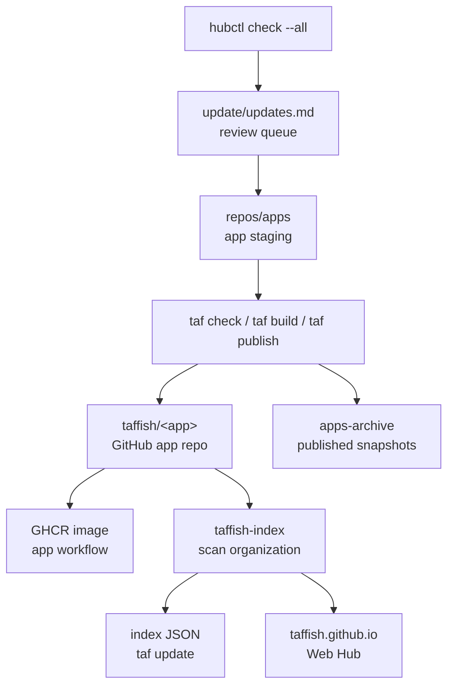

# taffish-hub Architecture

This document records `taffish-hub` as the local factory for the TAFFISH ecosystem. It explains how `taffish-hub` organizes app worktrees, public repository sources, index, Web Hub, docs, website, upstream update queue, and archive snapshots.

`taffish-hub` is not the user's local TAFFISH home and not a standalone backend server. It is a maintainer-side workspace: maintainers prepare GitHub-facing repositories and app versions locally, publish them to the `taffish` GitHub organization, and finally let `taffish-index` and user-side `taf` consume them.

## Related Documents

| Document | Focus |
| --- | --- |
| [GitHub Organization Architecture](github-organization.md) | `taffish`, `taffish-org`, GHCR, and organization repository responsibilities. |
| [Automation Pipeline Architecture](automation-pipelines.md) | Automation boundaries for app image, index, Web Hub, Gitee mirror, and hubctl. |
| [App Release Lifecycle](app-release-lifecycle.md) | State progression for a single app from creation to user-installable state. |

This document focuses on the local `taffish-hub/` workspace itself: which directories exist, what each directory owns, what can be published, and what is maintainer-internal state.

## Core Role

The core role of `taffish-hub` is:

```text
local factory for TAFFISH GitHub repositories
```

This means:

1. Directories under `repos/<name>/` should be usable as independent GitHub repository roots.
2. App worktrees under `repos/apps/` should eventually be published as `taffish/<app>` repositories.
3. `update/`, `apps-archive/`, `hubctl/`, and similar directories are maintainer-side control plane and not user installation sources.

Therefore, `taffish-hub` is not a backend that users install. Its outputs are what users see: GitHub app repositories, static JSON in `taffish-index`, the `taffish.github.io` Web Hub, `taffish-docs`, and optionally the `taffish.com` homepage.

## Current Workspace Layout

Current layout:

```text
taffish-hub/
  taffish-hub.toml
  README.md
  docs/
  repos/
    README.md
    .github/
    taffish-index/
    taffish.github.io/
    taffish-docs/
    apps/
      README.md
      bio/
        tools/
          augustus/
          autodock-vina/
  apps-archive/
    README.md
  update/
    README.md
    updates.md
    archive/
  hubctl/
    README.md
    src/
    scripts/
    target/
  taffish.com/
    README.md
    public/
    notes/
```

`taffish-hub.toml` anchors the workspace:

```toml
[hub]
name = "taffish-hub"

[paths]
repos_apps = "repos/apps"
apps_archive = "apps-archive"
update = "update"
```

`hubctl` uses it to identify the Hub root and locate app staging, archives, and update queue.

## Directory Responsibilities

| Directory | Role | Published to users? |
| --- | --- | --- |
| `repos/` | GitHub-facing repository source area | Children are published separately. |
| `repos/apps/` | taf-app staging area | App children become independent app repositories. |
| `repos/taffish-index/` | Static index repository source | Published as `taffish/taffish-index`. |
| `repos/taffish.github.io/` | Web Hub source | Published as `taffish/taffish.github.io`. |
| `repos/.github/` | GitHub organization profile | Published as `taffish/.github`. |
| `repos/taffish-docs/` | Public documentation repository source | Published as `taffish/taffish-docs`. |
| `docs/` | Hub workspace documentation source | Migration-time docs, eventually converging into `taffish-docs`. |
| `taffish.com/` | Official homepage workspace | `public/` can be deployed to `taffish.com`. |
| `apps-archive/` | Published app snapshot archive | Not directly published; maintainer record. |
| `update/` | upstream update queue | Not directly published; maintainer record. |
| `hubctl/` | Hub control tool source and build artifacts | Maintainer-side tool. |

The most important boundary: `repos/apps/` is not meant to become a `taffish/apps` repository. It is a staging area. Each app inside it should become its own GitHub repository.

## repos: GitHub-Facing Repository Area

Direct children under `repos/` usually map to GitHub repositories:

```text
repos/taffish-index       -> github.com/taffish/taffish-index
repos/taffish.github.io   -> github.com/taffish/taffish.github.io
repos/.github             -> github.com/taffish/.github
repos/taffish-docs        -> github.com/taffish/taffish-docs
```

Rules:

1. Directory name should match the target GitHub repository name when possible.
2. Each child should work as an independent repository root.
3. Each child owns its own `.git`, README, workflows, and release cadence.
4. `repos/` itself is a local collection, not the final user-facing repository.

This layout lets maintainers manage multiple public repositories in one workspace while preserving repository independence.

## repos/apps: App Staging Area

`repos/apps/` contains taf-app worktrees being migrated, developed, or maintained.

Current organization can be domain/category based:

```text
repos/apps/
  bio/
    tools/
      augustus/
      autodock-vina/
```

This is local maintainer organization, not canonical repository path. After publishing to GitHub, the app's canonical identity remains:

```text
github.com/taffish/<app>
```

not:

```text
github.com/taffish/bio/tools/<app>
```

Each app worktree should keep normal TAFFISH app structure:

```text
<app>/
  taffish.toml
  src/main.taf
  docs/help.md
  README.md
  LICENSE
  docker/Dockerfile
  .github/workflows/build-image.yml
```

Maintainers do the following here:

1. Run `taf new` or migrate an old app.
2. Edit `taffish.toml`, `.taf`, Dockerfile, help docs, and meta/upstream metadata.
3. Run `taf check`, `taf run`, `taf build`, and required scientific smoke tests.
4. Run `taf publish --release --dry-run`.
5. Run `taf publish --release --yes --build`.
6. Copy the published snapshot to `apps-archive/`.

`hubctl check --all` recursively scans `taffish.toml` files under this directory.

## apps-archive: Published Snapshot Archive

`apps-archive/` stores maintainer-side snapshots of published app versions. Suggested layout:

```text
apps-archive/
  taf-example/
    versions/
      1.2.3/
        r1/
          taffish.toml
          src/
          docker/
          README.md
```

It exists to:

1. Keep a local record of published versions.
2. Compare multiple releases of the same app.
3. Inspect previous packaging when upstream changes.
4. Support batch review inside the Hub workspace.

It is not canonical source. Public source remains the GitHub app repository and release tag. Do not let `apps-archive/` become a second publishing source.

## update: Maintenance Queue

`update/` stores upstream check reports generated by `hubctl`.

Core file:

```text
update/updates.md
```

`hubctl check --all` appends dated scan batches. Open items use `[?]`; after the maintainer migrates, tests, publishes, and archives an app update, the item can be marked `[x]`.

Current semantics:

1. `updates.md` is a human review queue, not an automatic publish instruction.
2. If unresolved `[?]` items exist, `hubctl` should not append a new batch.
3. `update/archive/` can hold old reports or migrated history.

This prevents upstream detection from burying unfinished work under repeated reports. TAFFISH app upgrades still need human judgment: upstream reliability, license changes, parameter compatibility, image buildability, and scientific output reasonableness.

## hubctl: Maintainer Control Tool

`hubctl/` is the maintainer-side automation tool for TAFFISH Hub.

It intentionally does one thing for now:

```sh
hubctl/target/hubctl check --all
```

It:

1. Finds the Hub root through `taffish-hub.toml`.
2. Scans apps under `repos/apps/`.
3. Reads `[package]` and `[upstream]`.
4. Checks upstream GitHub tags with `git ls-remote`.
5. Writes or displays results through `update/updates.md`.

It does not:

1. Edit apps.
2. Build Docker images.
3. Publish GitHub repositories.
4. Create GitHub Releases.
5. Archive app snapshots.
6. Synchronize Gitee mirrors.

This boundary is important. `hubctl` is a reminder and queue tool, not an automatic migration system. Future semi-automation can be added, but each step should keep a review gate.

## taffish-index: Static Index Repository

`repos/taffish-index/` is the `taffish-index` repository source. It turns GitHub app repositories into static JSON consumed by users.

Key files:

```text
repos/taffish-index/
  .github/workflows/build-index.yml
  scripts/build-index.lisp
  src/
  index/
    index.json
    packages/
    commands/
```

It:

1. Runs manually or daily through GitHub Actions.
2. Installs SBCL.
3. Executes `scripts/build-index.lisp`.
4. Scans the `taffish` GitHub organization.
5. Validates app metadata and release tags.
6. Writes `index/`.
7. Commits and pushes if generated files changed.

Local tests can use `--local-repo` to scan staging apps, but the formal index should be based on GitHub organization state and release tags.

`taffish-index` does not build container images. It reads declared container metadata and writes it into the index.

## taffish.github.io: Web Hub

`repos/taffish.github.io/` is the Web Hub source. It reads static JSON from `taffish-index`:

```text
https://raw.githubusercontent.com/taffish/taffish-index/main/index/index.json
```

It provides:

1. app search and filters.
2. tool / flow classification.
3. package detail view.
4. version list.
5. dependencies, platform, container, meta, and upstream display.
6. install command copy.
7. index warnings display.

It is a presentation layer, not required for CLI operation. If the website fails, users can still use `taf update` and `taf install` as long as `taffish-index` is available.

## taffish-docs: Public Documentation Repository

`repos/taffish-docs/` is the public documentation repository for users, app authors, and Hub maintainers.

Difference from implementation docs:

| Location | Audience | Boundary |
| --- | --- | --- |
| `taffish/docs/` | TAFFISH implementation maintainers and contributors | Source-tree developer docs, specification drafts, architecture memory. |
| `taffish-hub/repos/taffish-docs/` | public users and app authors | Quick start, language tutorial, app development guide, public specs, troubleshooting. |
| `taffish-hub/docs/` | Hub workspace documentation source | Migration-time docs, converging into `taffish-docs`. |

Long term, public user/app-author docs should be sourced from `taffish-docs`; TAFFISH repository docs should keep implementation, architecture, and governance memory close to the source code.

## .github: Organization Profile

`repos/.github/` publishes to:

```text
github.com/taffish/.github
```

GitHub renders:

```text
profile/README.md
```

at:

```text
https://github.com/taffish
```

It should contain:

1. One-line TAFFISH positioning.
2. Install entry.
3. Hub and docs entries.
4. `taffish-index` and app ecosystem entry.
5. Current status.

The organization profile should not carry detailed tutorials. Tutorials belong in `taffish-docs`; app browsing belongs in `taffish.github.io`.

## taffish.com: Official Homepage Workspace

`taffish.com/` is the official project homepage workspace. It is currently static:

```text
taffish.com/
  public/
    index.html
    assets/
  notes/
```

Site roles:

| Site | Role |
| --- | --- |
| `taffish.com` | Project homepage and stable public entry point. |
| `taffish.github.io` | App registry / Web Hub. |
| `github.com/taffish` | Developer and source-code entry point. |
| `taffish/taffish-docs` | Documentation entry point. |

`public/` can be deployed to the website hosting root; `notes/` is for maintainer drafts and deployment notes and should not be uploaded.

## Maintainer Data Flow

From a maintainer's perspective:



Only `taffish/<app>`, GHCR, `taffish-index`, and Web Hub are user-visible paths. `repos/apps`, `update/`, and `apps-archive/` are maintainer-side paths.

## Current Automation Boundary

Current automated or semi-automated capabilities:

| Capability | Current form |
| --- | --- |
| app skeleton | generated by TAFFISH main project `taf new`. |
| app publishing | performed by `taf publish` through git/gh. |
| app image build | performed by each app repository's GitHub Actions. |
| index generation | performed by `taffish-index` GitHub Actions. |
| upstream detection | performed locally by `hubctl check --all`. |
| Web Hub display | performed by `taffish.github.io` reading static index. |

Still manual maintainer work:

1. app migration.
2. scientific validity checks.
3. Dockerfile fixes and image debugging.
4. pre-publish review.
5. GHCR visibility checks.
6. archive snapshots.
7. Gitee mirror sync.
8. deciding whether to accept upstream updates.

This is a good boundary for early TAFFISH Hub. The goal is not to make all bioinformatics maintenance unattended; it is to put mechanical parts on reliable rails and leave judgment-heavy parts to maintainers.

## Boundary With User-Side taf

User-side `taf` does not read the `taffish-hub/` workspace. Users care that:

1. `taf update` downloads the index.
2. `taf search` / `taf info` query the local index.
3. `taf install` clones app source refs.
4. Installed commands build and run.
5. Containerized app images can be pulled by the local runtime.

Therefore, staging, archive, update queue, and hubctl should not leak into concepts users must understand. They serve maintainers, not users.

## Migration-Time Suggestions

While `taffish-hub` continues to migrate:

1. Put every new publishable repository under `repos/<repo-name>/` and ensure it can be published independently.
2. Put each migrated app under `repos/apps/<domain>/<kind>/<app>/`, but keep `taffish.toml` repository URL as `https://github.com/taffish/<app>`.
3. After app publication, copy the snapshot to `apps-archive/<app>/versions/<version>/r<release>/`.
4. Upstream checks should only create a queue and should not edit apps directly.
5. `taffish-index` should index canonical GitHub state, not local staging as a formal source.
6. `taffish.github.io` should display the index and not maintain a separate app list.
7. Duplicated content between `taffish-docs` and `docs/` should converge over time.
8. `taffish.com` should remain the homepage and not become the app registry.

## Maintenance Checklist

When changing `taffish-hub` structure, check:

1. `taffish-hub.toml` paths remain correct.
2. `hubctl check --all` can still find `repos/apps`.
3. `apps-archive/` only stores release snapshots and does not become source of truth.
4. `update/updates.md` remains a human review queue.
5. `repos/<name>` can still act as an independent GitHub repository root.
6. `taffish-index` still scans GitHub organization, not local staging as formal source.
7. `taffish.github.io` still reads from `taffish-index`.
8. `taffish-docs` aligns with the public documentation entry point.
9. `taffish.com/public` contains only deployable public content.
