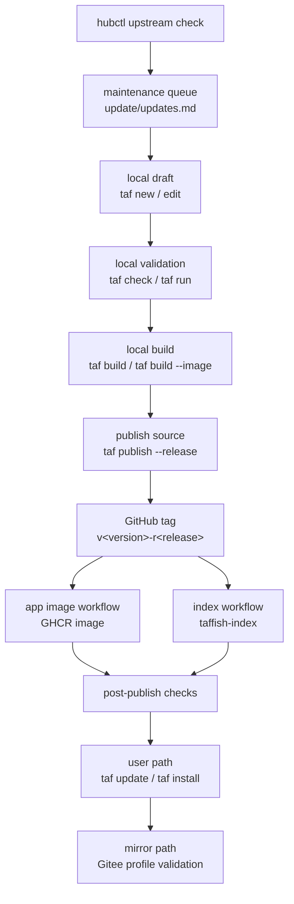

# app 发布生命周期

本页记录一个 TAFFISH app 从创建、验证、发布、索引、镜像到后续维护的完整生命周期。它描述的是维护者和自动化如何协作，不替代 `taf publish` 的源码实现，也不替代 app 项目格式、index schema 或容器运行时规范。

核心目标是让每个 app 版本都有清楚的身份：

```text
package version  ->  0.1.0
package release  ->  1
version id       ->  0.1.0-r1
git tag          ->  v0.1.0-r1
container image  ->  ghcr.io/taffish/<app>:0.1.0-r1
command artifact ->  taf-<app>-v0.1.0-r1
```

## 与其他文档的关系

| 文档 | 关注点 |
| --- | --- |
| [GitHub 组织架构](github-organization.md) | 仓库、组织、Gitee 镜像和权限拓扑。 |
| [自动化流水线架构](automation-pipelines.md) | app image、index、Web Hub、Gitee mirror、hubctl 的自动化分工。 |
| [taffish-hub 架构](taffish-hub-architecture.md) | 维护者本地工厂中的 app staging、update queue 和 archive。 |
| [TAFFISH 项目规范](../../standards/zh-CN/taffish-project-spec.md) | `taffish.toml`、目录结构、`docs/help.md` 等格式契约。 |
| [hub index 规范](../../standards/zh-CN/hub-index-spec.md) | app 发布后进入 index 的机器可读记录。 |

本页把这些内容串成“什么时候该做什么”的生命周期。

## 生命周期状态

一个 app 版本可以处于以下状态：

| 状态 | 代表产物 | 说明 |
| --- | --- | --- |
| 草稿 | 本地 app 工作树 | app 还在编辑，不能被用户安装。 |
| 已校验 | `taf check` 通过 | 元数据、主 `.taf`、帮助文档、依赖和容器声明满足基本契约。 |
| 已构建 | `target/` 产物 | 本地 command wrapper 已生成；容器化 app 可额外构建本地镜像。 |
| 已发布源码 | GitHub commit、tag、Release | canonical source ref 已存在，index 可以引用。 |
| 已发布镜像 | GHCR image | 容器化 app 的 OCI image 已推送，并应设为 public。 |
| 已索引 | `taffish-index/index/*.json` | 用户执行 `taf update` 后能发现该版本。 |
| 已镜像 | Gitee source/index mirror | 中国用户可通过 mirror profile 读取 index 和 clone source。 |
| 已验证安装 | 本地 `taf install` 成功 | 从用户路径验证 app 能被发现、安装和运行。 |
| 维护中 | `hubctl` / 新 release | 后续 upstream 更新、包装修复或文档修订。 |
| 已归档 | `apps-archive/` snapshot | 发布版本在 hub 工作区中保留人工归档快照。 |

这些状态不是都由一个命令推进。TAFFISH 的设计刻意把“本地校验”“GitHub 发布”“GHCR 构建”“index 扫描”“镜像同步”拆开，让失败可以局部处理。

## 总体流程



## 阶段一：创建 app 草稿

app 通常由 `taf new` 创建：

```sh
taf new my-tool --tool --docker
```

或创建 flow：

```sh
taf new my-flow --flow
```

典型 app 结构：

```text
my-tool/
  taffish.toml
  src/main.taf
  docs/help.md
  README.md
  LICENSE
  release.md
  docker/Dockerfile
  .github/workflows/build-image.yml
```

其中 `release.md` 是本地发布草稿，会被 `.gitignore` 忽略。它不是 app 源码的一部分，但 `taf publish --release` 会读取它。

新建后应立即确认：

1. `[package].name` 是最终 package 名，不要后续频繁改名。
2. `[repository].url` 指向 GitHub canonical 仓库，不写 Gitee 或内网镜像。
3. `[command].name` 以 `taf-` 开头。
4. 公开 Hub app 应补 `[meta]`，用于发现和分类。
5. tool app 尽量补 `[upstream]`，记录被包装软件来源、版本、上游开源协议/许可证、citation/DOI/PMID 和 source。
6. flow app 明确依赖哪些 taf app，不把外部科学依赖藏在文档里。

## 阶段二：补齐元数据和科学上下文

发布 app 不只是把 `.taf` 放进仓库。维护者应把这些信息整理到项目中：

| 内容 | 位置 | 作用 |
| --- | --- | --- |
| app 身份 | `[package]` | 决定 version id、tag、index 记录和用户安装目标。 |
| canonical 仓库 | `[repository].url` | index 记录的 source identity。 |
| 命令入口 | `[command]` / `src/main.taf` | 决定用户安装后的 command name。 |
| 运行语义 | `[runtime]` | 决定 pipe、command mode 等行为。 |
| 发现元数据 | `[meta]` | 记录 domain、category、summary 和搜索关键词。 |
| 容器声明 | `[container]` | 决定 image、Dockerfile 和构建平台。 |
| 平台约束 | `[platform]` | 记录 OS、arch、container requirement、资源需求。 |
| 上游来源 | `[upstream]` | 记录原始生信工具、版本、主页、发布页、上游已有镜像、论文归属和上游开源协议/许可证。 |
| 帮助文档 | `docs/help.md` | 供 `taf check`、Hub 和用户理解 app。 |
| 发布说明 | `release.md` | 供 publish message 和 GitHub Release notes 使用。 |

`[meta]` 是发现元数据，帮助 Hub/index 搜索和展示，但本地命令不应该强制要求。

`[upstream]` 对 tool wrapper 尤其重要。它不只是展示字段，也支撑 `hubctl`
后续做 upstream 版本检测，并让 index 消费端能展示上游 license 和学术归属信息。
`[upstream].license` 不同于 `[package].license`：前者属于被包装的上游项目，
后者属于 TAFFISH wrapper 项目。对于学术型工具，优先写入经过确认的
`citation`、`doi` 和 `pmid` 字段，不要只把论文信息藏在 prose 中。缺少
upstream 元数据的 app 仍然可以发布，但生态维护成本会更高。

## 阶段三：本地校验

发布前必须先让项目通过：

```sh
taf check
```

`taf check` 的意义不是测试科学结果，而是确认 app 符合 TAFFISH 生态契约。它至少应覆盖：

1. `taffish.toml` 必需字段存在且类型正确。
2. `[repository].url` 是 GitHub canonical URL。
3. `[package].version` 和 `[package].release` 能形成合法 version id。
4. `[package].main` 指向存在的 `.taf` 文件。
5. `docs/help.md` 存在。
6. `[command].name` 合法。
7. 容器化 app 的 `[container].image` tag 与 version id 一致。
8. 容器化 app 的主 `.taf` 文件引用同一个 image。
9. 容器化 app 声明了合法 `[smoke]` 元数据。
10. flow app 的 dependencies 与实际引用保持一致。

维护者还应运行最小本地 smoke test：

```sh
taf run -- --help
```

或使用该 app 真实需要的最小输入数据运行一次。`taf check` 不能替代科学有效性检查。

## 阶段四：本地构建

普通构建：

```sh
taf build
```

这会生成本地 command wrapper，典型产物是：

```text
target/taf-<app>-v<version>-r<release>
target/.taf-<app>-v<version>-r<release>/
```

构建后的 command 使用冻结 source snapshot，而不是实时读取当前 `src/`。这使发布版本和本地验证更接近用户安装后的状态。

容器化 app 如果需要本地试运行镜像，应显式构建 image：

```sh
taf build --image --backend docker
```

或一次构建 command 与 image：

```sh
taf build --all --backend docker
```

注意：`taf publish --release --yes --build` 当前只在发布前构建 command wrapper，不负责构建并推送 GHCR 镜像。远端镜像发布由 app 仓库自己的 GitHub Actions workflow 接力完成。

## 阶段五：发布前 dry-run

发布前编辑 `release.md`。第一行必须是可用的发布摘要，不能保留默认的 `# TODO: release summary` 占位符。整个文件会成为 GitHub Release notes。

先运行：

```sh
taf publish --release --dry-run
```

dry-run 应检查：

1. 目标 repository 是否正确。
2. 目标 tag 是否为 `v<version>-r<release>`。
3. 远端是否已存在同名 tag。
4. latest 发布策略是否允许当前版本。
5. 是否会创建 GitHub Release。
6. 计划执行的 git/gh 命令是否符合预期。

如果远端仓库还不存在，维护者可以选择先手动创建，也可以在发布时使用：

```sh
taf publish --release --yes --build --create-repo --public
```

早期官方 Hub 推荐 public app 仓库。私有 app 可以用于内部测试，但不应进入公开 index。

## 阶段六：发布 canonical source

正式发布：

```sh
taf publish --release --yes --build
```

发布过程会：

1. 运行 `taf check`。
2. 检查 `LICENSE`，拒绝空许可证或模板占位许可证。
3. 读取 `[repository].url`。
4. 检查远端 tag。
5. 检查 latest/pre 策略。
6. 从 `release.md` 准备 commit message 和 GitHub Release notes。
7. 必要时构建 command wrapper。
8. `git add -A`。
9. 如使用 release notes，则把 `release.md` 从 git index 中移除。
10. commit 当前项目变更。
11. 创建 tag `v<version>-r<release>`。
12. push branch 和 tag。
13. 创建 GitHub Release。

`taf publish` 不负责 GitHub 登录。维护者应提前配置 SSH key、git credential helper 或 GitHub CLI auth。

`taf publish` 也不负责 Gitee 镜像同步。Gitee 是读取路径和镜像路径，不是 canonical publish target。

## 阶段七：发布容器镜像

如果 app 带 Dockerfile，tag push 会触发 app 仓库中的：

```text
.github/workflows/build-image.yml
```

这个 workflow 读取 `taffish.toml` 中的 `[container]`：

```toml
[container]
image = "ghcr.io/taffish/my-tool:0.1.0-r1"
dockerfile = "docker/Dockerfile"
build_platforms = "linux/amd64,linux/arm64"
```

镜像发布后必须检查：

1. workflow 是否成功。
2. GHCR package 是否属于 `taffish` 组织。
3. GHCR package visibility 是否为 public。
4. image tag 是否存在。
5. image tag 是否与 `taffish.toml` 和 `.taf` container tag 一致。
6. 用户运行机器是否能访问该 registry。

镜像失败时，不应修改已经发布的 tag。修复 Dockerfile 或包装逻辑后，应增加 `release`，发布新 tag，例如从 `0.1.0-r1` 到 `0.1.0-r2`。

## 阶段八：进入 index

app 源码发布后，`taffish-index` 的 workflow 会扫描 GitHub `taffish` 组织：

```text
taffish-index/.github/workflows/build-index.yml
```

它会优先读取 release tag，而不是默认分支。一个 app 被写入 index 通常需要满足：

1. 仓库根目录存在 `taffish.toml`。
2. 必需字段合法。
3. `[repository].url` 指向当前 GitHub 仓库。
4. `[package].main` 文件存在。
5. `docs/help.md` 存在。
6. release tag 格式为 `v<version>-r<release>`。
7. 容器字段、依赖字段、平台字段能被 index builder 正确解析。
8. release 源码 commit 可以被记录为 `source.commit`。
9. 容器化 app 可以通过声明的 `[smoke]` 检查，并产生 digest/platform 元数据。

index workflow 成功后，会把生成文件提交回 `taffish-index`：

```text
index/index.json
index/packages/<package>.json
index/commands/<command>.json
```

从用户侧供应链追踪看，关键结果不只是 package 出现在 index 中。index 还应在适用时携带
source commit、container digest/platform 元数据和 smoke 状态。

如果 app 未出现在 index，应先检查 index workflow 的 warnings，再检查 app 仓库是否满足发现规则。

## 阶段九：用户路径验证

发布不是以 GitHub tag 存在为终点，而是以用户能通过 index 安装为终点。

维护者应在干净环境或隔离的 TAFFISH home 下验证：

```sh
taf update
taf search my-tool
taf info my-tool
taf install --dry-run my-tool
taf install my-tool
taf which taf-my-tool
taf-my-tool -- --help
taf-my-tool-v0.1.0-r1 -- --help
```

需要验证的不是“本地工作树能运行”，而是“用户从 index 发现、从 source ref/commit
安装、在 `source.commit` 存在时通过安装侧 source commit 校验、并运行安装后的 command”。

对于 flow app，还应确认 dependencies 会被自动安装：

```sh
taf install my-flow
taf list
```

对于容器化 app，还应确认容器 backend 和 registry 可用：

```sh
taf-my-tool -- --help
```

如果需要强制指定本地开发 backend，应回到 app 工作树中使用 `taf run --backend docker -- --help` 复核；安装后的 command 应按自身编译出的 container tag 和运行时规则执行。

## 阶段十：Gitee 和中国镜像验证

Gitee 组织名是：

```text
taffish-org
```

镜像侧需要同步：

1. `taffish/taffish`。
2. `taffish/taffish-index`。
3. 对应 app 仓库。
4. 对应 release tag。

中国 profile 通过配置改变读取路径：

```toml
[index]
url = "https://gitee.com/taffish-org/taffish-index/raw/main/index/index.json"

[[source.rewrite]]
from = "https://github.com/taffish/"
to = "https://gitee.com/taffish-org/"
enabled = true
```

验证方式：

```sh
taf config init --china --force
taf update
taf install my-tool
```

Gitee mirror 不改变 index schema，不改变 package identity，也不把 canonical source 改成 Gitee。它只是让用户侧从镜像 URL 下载 index 和 clone app source。

容器镜像是另一条链路。中国 mirror profile 不会自动把 GHCR 改写成其他 registry。需要中国用户运行容器化 app 时，仍应确认运行机器能拉取对应 OCI image。

## 阶段十一：归档和维护

在 `taffish-hub` 工作区中，发布后的 app 可以人工复制到：

```text
apps-archive/
```

归档的作用不是替代 Git tag，而是给维护者保留一个本地发布快照，方便后续比较、迁移和批量维护。

`hubctl` 负责 upstream 检测：

```sh
hubctl/target/hubctl check --all
```

它会把待处理项写入：

```text
update/updates.md
```

当维护者完成一个 app 的 upstream 迁移、测试、发布和归档后，可以在该 app 项目中标记完成：

```sh
hubctl/target/hubctl check --finish
```

`hubctl` 不会自动编辑 app，不会自动构建镜像，也不会自动发布。它只是维护队列。

## 版本推进规则

增加 `release` 的情况：

1. TAFFISH 包装逻辑修复。
2. Dockerfile 修复。
3. `docs/help.md` 修复。
4. `taffish.toml` 元数据修复。
5. 上游软件版本不变，但 app 打包方式变化。
6. GHCR image 需要重新发布，且不应覆盖旧 tag。

增加 `version` 的情况：

1. 上游软件版本变化。
2. flow 的主要科学流程或默认行为变化。
3. app 对用户可见的功能语义发生变化。
4. 需要让用户明确选择新行为，而不是透明替换旧行为。

不要覆盖已经发布的 tag。发布后发现问题，应发布新的 `release`。

## 失败恢复原则

| 失败点 | 处理方式 |
| --- | --- |
| `taf check` 失败 | 修复本地项目后重新检查，不发布。 |
| dry-run 发现仓库或 tag 错误 | 修正 `taffish.toml` 或发布参数，不创建 tag。 |
| `taf publish` push 前失败 | 修复本地 git 状态后重新运行。 |
| tag 已推送但 GitHub Release 失败 | 不改 tag；可手动补 GitHub Release，或用新 release 修复。 |
| GHCR 构建失败 | 修复 Dockerfile 或元数据，增加 `release` 后重新发布。 |
| GHCR package 不是 public | 调整 package visibility，不需要改 app source。 |
| index 未收录 | 查 index workflow warnings，修复 app 元数据后发布新 release。 |
| Gitee mirror 落后 | 同步 mirror，不改 canonical index。 |
| 用户安装失败 | 区分 index 下载、source clone、build、container pull、runtime 五类问题。 |

最重要的规则是：已经公开的 Git tag 和 image tag 视为不可变。如果需要修复，就推进 `release`，不要覆盖历史。

## 发布前检查清单

- [ ] `taffish.toml` 中 `name`、`version`、`release`、`repository.url` 正确。
- [ ] `command.name` 以 `taf-` 开头。
- [ ] `src/main.taf` 可以被 `taf check` 解析。
- [ ] `docs/help.md` 已更新。
- [ ] `LICENSE` 不是空文件或模板占位文件。
- [ ] 如果准备进入官方 index，已补 `[meta]` 供公开 Hub 发现和分类。
- [ ] 如果包装第三方生信软件，已补 `[upstream]`，包括已知的上游 license 和 citation/DOI/PMID。
- [ ] 如果是容器化 app，`[container].image` tag 等于 `<version>-r<release>`。
- [ ] 如果是容器化 app，`[smoke]` 声明了最小 executable 和/或 command 检查。
- [ ] 如果是容器化 app，本地 `taf build --image --backend ...` 和 `taf run --backend ...` 使用一致后端。
- [ ] 如果是 flow app，dependencies 与实际引用一致。
- [ ] `taf run` 或真实最小用例通过。
- [ ] `taf build` 或 `taf build --all` 通过。
- [ ] `release.md` 第一行和 release notes 已整理。
- [ ] `taf publish --release --dry-run` 输出符合预期。

## 发布后检查清单

- [ ] GitHub repository 存在且位于 `taffish/<app>`。
- [ ] Git tag `v<version>-r<release>` 存在。
- [ ] GitHub Release notes 正确。
- [ ] 如果是容器化 app，`build-image.yml` 成功。
- [ ] 如果是容器化 app，GHCR package 为 public。
- [ ] 如果是容器化 app，index 自动化记录了 digest/platform 元数据和 smoke 状态。
- [ ] index record 为 release tag 记录了 `source.commit`。
- [ ] `taffish-index` workflow 成功。
- [ ] `index/index.json` 中存在该 package/version。
- [ ] `taffish.github.io` 能展示该 app。
- [ ] `taf update` 后可以 `taf search` / `taf info`。
- [ ] `taf install --dry-run <app>` 输出符合预期。
- [ ] `taf install <app>` 后命令可运行。
- [ ] `taf which <app>` / `taf list --json` 在存在源码 commit 时展示对应元数据。
- [ ] Gitee mirror 同步完成。
- [ ] China profile 下 `taf update` / `taf install` 可用。
