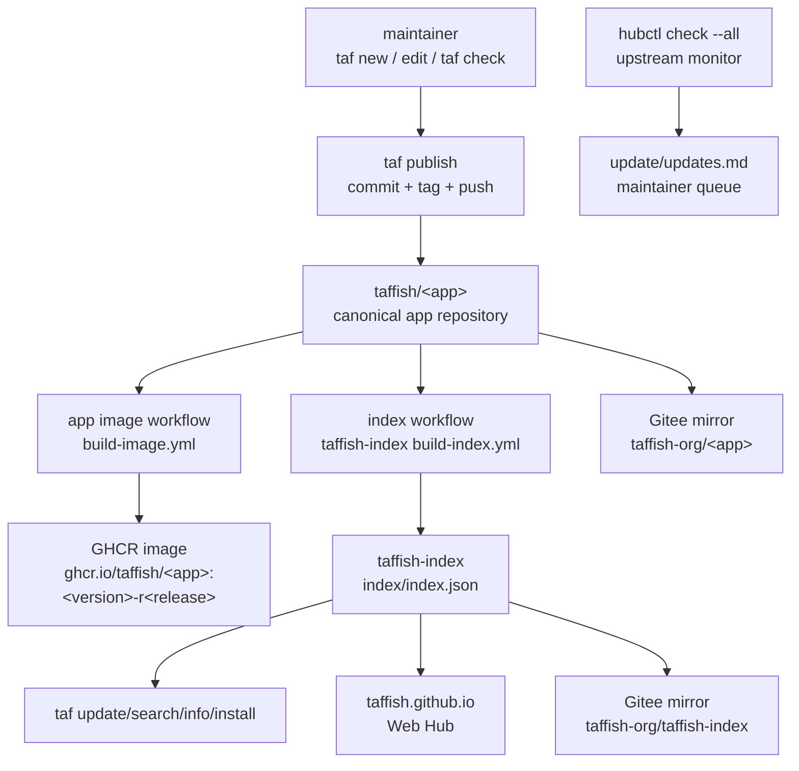

# 自动化流水线架构

本页记录 TAFFISH 生态中几个自动化如何分工：app 仓库构建容器镜像，`taffish-index` 扫描组织并生成静态索引，Web Hub 展示索引，Gitee 只作为仓库镜像和访问优化层，`hubctl` 负责维护者侧的 upstream 监测。

这里描述的是系统链路，不替代具体 workflow 文件、`taffish.toml` 规范或 index schema。字段细节仍以 standards 文档为准。

## 当前状态

从 TAFFISH 主项目和隔壁 `taffish-hub` 的当前实现看，自动化状态可以分为三类：

| 类别 | 当前状态 | 说明 |
| --- | --- | --- |
| app 镜像 workflow | TAFFISH 端已具备生成能力 | `taf new --docker` 会生成 `.github/workflows/build-image.yml`，由每个 app 仓库自己运行。 |
| index 生成 workflow | `taffish-index` 已有实现 | `.github/workflows/build-index.yml` 支持手动触发和每日定时扫描 `taffish` 组织。 |
| maintainer upstream 检测 | `taffish-hub` 已有本地工具 | `hubctl check --all` 生成 `update/updates.md`，只报告 upstream 版本变化。 |

`taffish-hub` 当前 README 的状态说明是：目前只有 upstream detection 自动化；app 迁移、测试、Docker 镜像构建、发布和归档快照仍然是人工维护者工作。换句话说，生态架构已经定型，但迁移期不能把“设计上应当自动化”和“当前已经完全自动化”混为一谈。

## 总体数据流



核心原则是：每条自动化只负责自己的产物，不跨层修改其他仓库。

## 自动化一：app 镜像发布

app 镜像发布属于每个 taf-app 仓库自己的职责，不属于 `taffish-index`，也不属于 `taffish.github.io`。

典型位置：

```text
taffish/<app>/
  taffish.toml
  docker/Dockerfile
  .github/workflows/build-image.yml
```

TAFFISH 当前的 `taf new --docker` 会生成这个 workflow。它的基本行为是：

1. 在 push tag `v*` 或手动 `workflow_dispatch` 时运行。
2. checkout app 仓库。
3. 用 Python `tomllib` 读取 `taffish.toml`。
4. 读取 `[container].image`、`[container].dockerfile`、`[container].build_platforms` 和可选 `[smoke]`。
5. 登录 GHCR。
6. 用 Docker Buildx 构建并推送架构镜像。
7. 用 `docker buildx imagetools create` 发布最终 manifest。

当前模板默认总是构建 `linux/amd64`；如果 `build_platforms` 包含 `linux/arm64`，会尝试构建 arm64。arm64 构建允许失败，失败时发布 amd64-only manifest。

app image workflow 可以运行仓库内的 smoke 检查，但公开 package index 的最终接纳/拒绝应属于
index builder，因为它能检查最终已发布镜像的 digest/platform 集合。

所需权限：

```yaml
permissions:
  contents: read
  packages: write
```

镜像 tag 应与 TAFFISH version id 一致：

```text
ghcr.io/taffish/<app>:<version>-r<release>
```

app workflow 不应做这些事：

1. 不手工编辑 `taffish-index`。
2. 不生成全局 index。
3. 不同步 Gitee。
4. 不覆盖已发布 tag。
5. 不把 `latest` 当成正式 app 引用。

如果未来增加“app 发布完成后立即触发 index rebuild”，应把触发点放在镜像 workflow 成功之后，而不是 tag push 之后立即触发。否则 index 可能先记录了一个容器化 app，而 GHCR 镜像还没有构建成功或还不是 public。

## 自动化二：index 扫描与生成

`taffish-index` 是静态索引仓库。它的 workflow 位置是：

```text
taffish-index/.github/workflows/build-index.yml
```

当前触发方式：

```yaml
on:
  workflow_dispatch:
    inputs:
      include_default_branch:
        type: boolean
        default: false
  schedule:
    - cron: "17 1 * * *"
```

也就是手动触发和每日定时触发。当前 workflow 使用：

```yaml
permissions:
  contents: write

concurrency:
  group: taffish-index
  cancel-in-progress: false
```

核心命令：

```sh
sbcl --script scripts/build-index.lisp -- --org "taffish" --output index
```

workflow 会：

1. checkout `taffish-index`。
2. 安装 SBCL。
3. 扫描 `taffish` GitHub organization。
4. 读取每个候选 app 仓库的 `taffish.toml`、`docs/help.md` 和 release tag。
5. 生成 `index/index.json`、`index/packages/<package>.json` 和 `index/commands/<command>.json`。
6. 如果 `index/` 发生变化，自动 commit 并 push。

token 规则：

```text
TAFFISH_BOT_TOKEN -> 优先使用
GITHUB_TOKEN      -> 没有 bot token 时回退
```

index builder 的责任是发现、校验和记录 app 元数据。它不构建镜像，也不替 app 发布 release。
它可以把 `[container].image`、镜像 digest/platform 元数据和 `[smoke]` 结果写入 index，
但镜像本身必须由 app 仓库 workflow 负责发布。

对于 release tag 记录，index builder 还应把解析出的源码 commit 记录为
`source.commit`。`taf install` 会使用该字段在构建安装 command 前校验 resolved
source，因此 mirror 和 source rewrite 不会削弱源码可追踪性。

默认情况下，index 应优先索引 release tag。默认分支 snapshot 只适合开发和调试，应通过手动触发的 `include_default_branch` 显式打开。

## 自动化三：Web Hub 展示

`taffish.github.io` 是展示层。它消费 `taffish-index` 的静态 JSON，为用户提供搜索、筛选、详情页和安装命令。

如果 Web Hub 是纯静态前端，并在浏览器中直接读取：

```text
https://raw.githubusercontent.com/taffish/taffish-index/main/index/index.json
```

那么 index 更新后不一定需要重新部署网页。网页只需要在运行时读取最新 index。

如果未来 Web Hub 改成静态预渲染站点，则可以增加第三条 GitHub Actions：

1. `taffish-index` 更新后触发。
2. checkout `taffish.github.io`。
3. 读取 index。
4. 生成静态页面。
5. 部署 GitHub Pages。

这条流水线即使失败，也不应影响 `taf update` 和 `taf install`，因为 CLI 的机器可读入口是 `taffish-index`，不是网页。

## 自动化四：Gitee 镜像同步

Gitee 组织名是：

```text
taffish-org
```

它是中国用户的读取和安装优化层，不是 canonical 发布源。镜像同步可以是人工脚本、Gitee 仓库镜像功能，也可以是单独的 GitHub Actions。无论采用哪种方式，都应保持这些原则：

1. GitHub `taffish` 仍是 canonical identity。
2. Gitee `taffish-org` 只镜像仓库、tag 和 index 文件。
3. index 中的 source record 不应被改写成 Gitee。
4. 用户侧通过 `[index].url` 和 `[[source.rewrite]]` 改变读取路径。
5. `taf publish` 仍只面向 GitHub，不直接发布到 Gitee。

中国 profile 的典型配置是：

```toml
[index]
url = "https://gitee.com/taffish-org/taffish-index/raw/main/index/index.json"

[[source.rewrite]]
from = "https://github.com/taffish/"
to = "https://gitee.com/taffish-org/"
enabled = true
```

GitHub Actions workflow 文件即使被镜像到 Gitee，也不意味着 Gitee 会按 GitHub Actions 语义执行它们。镜像层应被当成分发路径，而不是第二套 canonical CI/CD。

容器 registry 也应单独考虑。`source.rewrite` 只重写 app 仓库 clone URL，不会自动把 `ghcr.io/taffish/<app>` 改写到其他 registry。如果某些用户无法访问 GHCR，需要 app 自己发布可访问的镜像来源，或未来扩展容器镜像 rewrite 机制。

## 维护者自动化：hubctl

`hubctl` 是 `taffish-hub` 中的维护者侧工具。它不是用户侧 CLI，也不是 app 仓库 workflow。

`taffish-hub` 工作区的整体目录和维护者数据流见 [taffish-hub 架构](taffish-hub-architecture.md)。

当前它只做一件自动化工作：

```sh
hubctl/target/hubctl check --all
```

它递归扫描 `repos/apps/` 下的 taf-app，读取 `[upstream]`，用 `git ls-remote` 检查上游 GitHub tags，并把待处理项写入：

```text
update/updates.md
```

`hubctl` 明确不做这些事：

1. 不编辑 taf-app 项目。
2. 不构建 Docker 镜像。
3. 不发布 GitHub 仓库。
4. 不创建 app release。
5. 不归档 release snapshot。

这很重要：upstream 版本发现可以半自动化，但生信 app 的迁移、参数校验、许可证检查、引用信息、镜像构建和复现实测仍需要维护者判断。

## 推荐触发矩阵

| 自动化 | 所在仓库 | 触发方式 | 写入对象 | 失败影响 |
| --- | --- | --- | --- | --- |
| app image build | `taffish/<app>` | tag push `v*` / 手动 | GHCR package | 影响该 app 的容器运行。 |
| index build | `taffish/taffish-index` | 每日定时 / 手动 | `index/` JSON 文件 | 影响 app 发现、搜索和安装元数据更新。 |
| Web Hub deploy | `taffish.github.io` | 可选，index 更新或手动 | GitHub Pages | 只影响网页展示。 |
| Gitee mirror sync | 镜像维护流水线 | 定时或手动 | `gitee.com/taffish-org/*` | 只影响中国镜像访问路径。 |
| upstream check | 本地 `taffish-hub` | 定时或手动 | `update/updates.md` | 只影响维护者更新队列。 |

## 为什么要拆成多条自动化

拆分不是为了复杂，而是为了隔离责任：

1. app 镜像构建可能很慢、很贵、很容易受上游编译问题影响，不应阻塞全局 index。
2. index 生成应该轻量、可重复、可人工重跑，不应拥有所有 app 的构建权限。
3. Web Hub 是展示层，失败时不应影响 CLI 使用。
4. Gitee 镜像是访问优化层，不能改变 canonical 元数据。
5. upstream 检测是维护者提醒，不应自动替维护者改科学软件版本。

这个设计也让早期单人维护可以逐步扩展成多人维护：每个 app 可以有自己的 maintainer，而 `taffish-index` 和组织级治理仍由核心维护者控制。

## 发布顺序建议

正式发布一个容器化 app 时，建议顺序是：

1. 本地完成 `taf check`、`taf build --all` 和必要的科学有效性检查。
2. 使用 `taf publish --release --dry-run` 查看发布计划。
3. 使用 `taf publish --release --yes --build` 推送 commit、tag 和 GitHub Release。
4. 等待 app 仓库的 `build-image.yml` 完成，并确认 GHCR package 是 public。
5. 手动运行或等待 `taffish-index` 的 `build-index.yml`；容器化 app 应通过声明的 `[smoke]`。
6. 用 `taf update` 和 `taf install <app>` 从 index 路径验证用户侧安装。
7. 同步 Gitee mirror，并用 China profile 验证 `taf update` / `taf install`。

如果未来需要更快的用户可见性，可以在第 4 步成功后让 app workflow 触发 `taffish-index` 的 rebuild。这个增强应作为可选事件驱动优化，而不是替代每日定时扫描。

完整 app 发布状态、人工检查点和失败恢复见 [app 发布生命周期](app-release-lifecycle.md)。

## 维护检查清单

修改自动化体系时，应检查：

1. `taf new --docker` 生成的 workflow 是否仍读取 `[container]` 字段。
2. app image tag 是否仍等于 `<version>-r<release>`。
3. `taf publish` 是否仍生成 `v<version>-r<release>` tag。
4. `taffish-index` 是否仍扫描 GitHub `taffish` 组织。
5. `taffish-index` 是否仍只写静态 JSON，不构建镜像。
6. Gitee mirror 是否仍保留 canonical GitHub 身份。
7. `hubctl` 是否仍只是 upstream 检测和维护队列，不自动修改 app。
