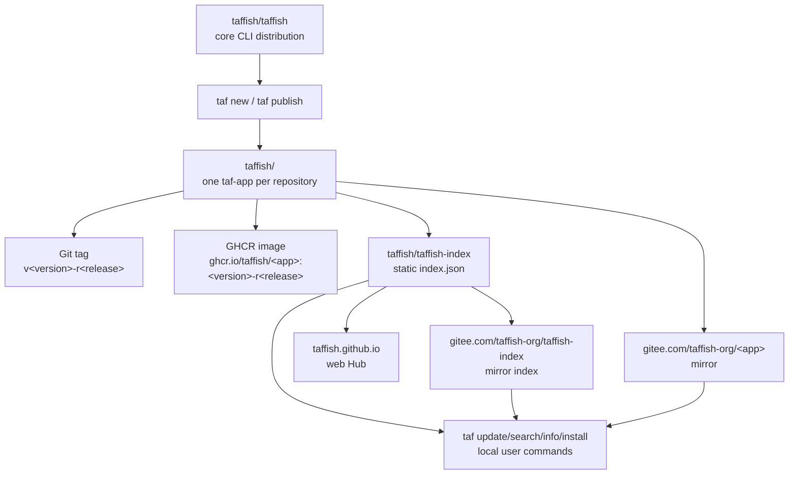

# GitHub 组织架构

本页记录 TAFFISH 的 GitHub 组织结构、仓库职责、发布链路和 Gitee 镜像关系。它描述的是生态拓扑，不替代 `taffish.toml`、hub index 或 install metadata 的字段规范。具体 GitHub Actions、index job、GHCR 发布和 Gitee 同步的分工，见 [自动化流水线架构](automation-pipelines.md)；单个 app 从创建到用户可安装的状态推进，见 [app 发布生命周期](app-release-lifecycle.md)；维护者本地工厂结构见 [taffish-hub 架构](taffish-hub-architecture.md)。

## 核心原则

TAFFISH 的 canonical 生态身份在 GitHub：

```text
GitHub organization: taffish
```

中国访问镜像在 Gitee：

```text
Gitee organization: taffish-org
```

这两个名字不能混用。GitHub 的 `taffish` 是 canonical identity；Gitee 的 `taffish-org` 是镜像和访问优化层。

## 顶层拓扑



## 组织内仓库类型

### 核心仓库

| 仓库 | 角色 | 说明 |
| --- | --- | --- |
| `taffish/taffish` | 核心源码与命令发布仓库 | 包含源码、`taf`、`taffish`、`taffish-mcp`、安装脚本、shell completion、Vim 文件、文档和二进制 release 载荷。 |
| `taffish/.github` | 组织首页仓库 | GitHub organization profile 和项目总览。 |

`taffish/taffish` 是源码仓库，也是本地 CLI 发行物入口。它应继续作为用户安装 `taf`、`taffish` 和 `taffish-mcp` 的核心入口。

### 文档和展示仓库

| 仓库 | 角色 | 说明 |
| --- | --- | --- |
| `taffish/taffish-docs` | 公共文档仓库 | 面向公开用户、开发者和 taf-app 作者的文档站。 |
| `taffish/taffish.github.io` | Web Hub 源码仓库 | 生成或托管 `taffish.github.io`。 |

本仓库里的 `docs/` 记录源码树相关的实现、规范和架构知识。它补充官网/用户文档，而不是替代它们。

### 索引仓库

| 仓库 | 角色 | 说明 |
| --- | --- | --- |
| `taffish/taffish-index` | 静态 app index | 发布 `index/index.json`，供 `taf update` 下载。 |

默认 index URL：

```text
https://raw.githubusercontent.com/taffish/taffish-index/main/index/index.json
```

index 是本地 `taf` 与远端 app 生态之间的目录层。用户的 `taf search`、`taf info`、`taf install` 都不直接扫描 GitHub organization，而是消费本地缓存的 index。

### app 仓库

每个 taf-app 应有独立仓库：

```text
taffish/<app-name>
```

默认 `taf new` 生成的 canonical repository URL：

```text
https://github.com/taffish/<app-name>
```

默认 container image：

```text
ghcr.io/taffish/<app-name>:<version>-r<release>
```

默认 command name：

```text
taf-<app-name>
```

默认 artifact name：

```text
taf-<app-name>-v<version>-r<release>
```

## app 仓库职责

一个 app 仓库应承担：

1. 保存 `taffish.toml`、`src/main.taf`、`docs/help.md`、README、LICENSE。
2. 用 Git tag 标识不可变版本。
3. 可选通过 GitHub Actions 构建并发布容器镜像。
4. 通过 release 或 tag 暴露可被 index 引用的 source ref。
5. 保持 `[repository].url` 指向 canonical GitHub URL。

app 仓库不应该自己充当全局 registry。全局发现、搜索和安装入口应由 `taffish-index` 和 Hub 承担。

带 Dockerfile 的 app 仓库也应拥有自己的 `build-image.yml`。`taf new --docker` 已经能生成这个 workflow：它在 tag push 或手动触发时读取 `[container]` 配置，构建并推送 `ghcr.io/taffish/<app>:<version>-r<release>`。这个 workflow 只负责该 app 的容器镜像，不负责全局 index。

## 发布链路

当前 `taf publish` 的目标是 GitHub。

典型链路：

```text
taf new
  -> 生成 taf-app 项目骨架
taf build
  -> 生成 target/<artifact>
  -> 同步 flow dependencies
taf publish
  -> 检查项目
  -> 检查 LICENSE / release.md
  -> git commit
  -> git tag v<version>-r<release>
  -> git push
  -> 可选 GitHub Release
app image workflow
  -> 构建并推送 GHCR 镜像
taffish-index workflow
  -> 读取 app metadata
  -> 更新 taffish-index
taf update
  -> 用户下载 index
taf install
  -> 用户按 index clone/copy source 并本地 build
```

其中 `taf publish` 不负责 GitHub 登录，也不负责 Gitee 镜像同步。认证、权限和镜像同步属于环境和平台治理问题。

更细的发布前检查、发布后验证和失败恢复流程见 [app 发布生命周期](app-release-lifecycle.md)。

## index 链路

`taffish-index` 是静态 JSON 索引仓库。它应只描述 canonical app 状态，不把镜像源伪装成 canonical 源。

核心原则：

1. index 中的 repository/source 默认指向 GitHub canonical URL。
2. Gitee 镜像通过用户配置中的 `source.rewrite` 实现。
3. index schema 必须符合 `taffish.index/v1`。
4. index 可以被 GitHub raw、Gitee raw 或本地文件分发，但 schema 不变。
5. index job 不构建 Docker/GHCR 镜像，只记录 app 已声明的 container metadata。

GitHub 默认：

```text
https://raw.githubusercontent.com/taffish/taffish-index/main/index/index.json
```

China profile 默认：

```text
https://gitee.com/taffish-org/taffish-index/raw/main/index/index.json
```

当前 `taffish-index` 的实现使用 GitHub Actions 每日定时或手动扫描 `taffish` 组织，并把生成的 `index/` 文件 commit 回 `taffish-index` 仓库。它优先索引 release tag，默认不把默认分支 snapshot 纳入正式 index。

## 自动化分工

TAFFISH 生态至少有四条相互独立的自动化：

| 自动化 | 所在位置 | 主要责任 |
| --- | --- | --- |
| app image build | `taffish/<app>/.github/workflows/build-image.yml` | 构建并推送该 app 的 GHCR 镜像。 |
| index build | `taffish/taffish-index/.github/workflows/build-index.yml` | 扫描 GitHub 组织，生成静态 JSON index。 |
| Web Hub deploy/read | `taffish/taffish.github.io` | 展示 index 中的 app、版本、依赖和安装命令。 |
| Gitee mirror sync | 镜像维护流水线 | 同步 GitHub canonical 仓库到 `taffish-org`。 |

`taffish-hub` 里还有维护者侧的 `hubctl`：它用于 upstream 版本检测和更新队列，不直接修改 app、不构建镜像、不发布仓库。

这些自动化必须保持职责隔离。app 构建失败不应破坏全局 index；网页部署失败不应影响 `taf update`；Gitee 镜像不应改写 canonical index；upstream 检测不应自动替维护者升级科学软件。

## Gitee 镜像层

Gitee 组织名是：

```text
taffish-org
```

它用于：

1. 镜像 `taffish/taffish`，方便下载安装脚本和二进制。
2. 镜像 `taffish/taffish-index`，方便 `taf update`。
3. 镜像 app 仓库，方便 `taf install` clone source。

Gitee 不改变 app 的 canonical identity。一个 app 即使从 Gitee clone，其 index record、repository URL 和 package 身份仍应以 GitHub `taffish/<app>` 为准。

source rewrite 示例：

```toml
[[source.rewrite]]
from = "https://github.com/taffish/"
to = "https://gitee.com/taffish-org/"
enabled = true
```

## GHCR 镜像命名

容器镜像默认位于：

```text
ghcr.io/taffish/<app-name>:<version>-r<release>
```

这和项目规范中的 `[container].image`、hub index 中的 `container.image`、运行时 container tag 应保持一致。

如果 app 仓库名和 image 名不同，必须在 `taffish.toml` 和 index 中明确记录，避免用户安装时出现 artifact 与 image 不一致。

## example 与正式 app 的命名

如果未来同时存在“正式专业版 app”和“复现实例 app”，建议用命名空间区分，而不是让 example 占用正式 command。

推荐原则：

| 类型 | repo | command | 说明 |
| --- | --- | --- | --- |
| 正式 app | `taffish/<name>` | `taf-<name>` | 可长期作为工具或流程依赖。 |
| example app | `taffish/example-<topic>` | `taf-example-<topic>` | 集成数据获取、参数和复现流程。 |

example app 可以依赖正式 app。这样论文案例、教学复现和生产使用不会混在同一个 package 身份里。

## 权限与治理建议

GitHub organization 应至少区分几类权限：

| 范围 | 建议权限 |
| --- | --- |
| `taffish/taffish` | 严格限制写权限，release 需要审核。 |
| `taffish-index` | 自动化 bot 可写，人工变更需要 review。 |
| app 仓库 | app maintainer 可写，核心维护者保留 admin。 |
| `.github` 和 docs | 核心维护者维护，避免首页信息漂移。 |
| GHCR packages | 与 app 仓库权限绑定，避免镜像被错误覆盖。 |

当 app 数量增加后，应考虑：

1. 用 GitHub teams 管理 app maintainer。
2. 用 branch protection 保护 `main`。
3. 用 tag protection 或 release workflow 避免覆盖已发布版本。
4. 用 automation 生成 index，避免手工编辑 JSON。
5. 用 bot token 或 GitHub App 管理 index 更新权限。

## 不属于 GitHub 组织架构的内容

以下内容不在本页定义：

1. `taffish.index/v1` 字段细节。
2. `taffish.toml` 字段细节。
3. 本地安装目录结构。
4. 具体 Common Lisp 函数如何实现 publish/install。
5. 每个 app 的科学有效性和参数质量。

这些内容分别由 standards、dev 文档和具体 app 审查承担。

## 维护检查清单

修改 GitHub/Gitee 组织架构时，应检查：

1. `taf new` 的默认 repository URL 是否仍正确。
2. `taf publish` 是否仍只面向 GitHub canonical 仓库。
3. `taf config init --china` 的 index URL 和 source rewrite 是否仍正确。
4. `taffish-index` 中是否仍使用 canonical GitHub source。
5. Gitee 镜像是否覆盖 `taffish`、`taffish-index` 和 app 仓库。
6. GHCR image 命名是否与 app repo、version id 和 container tag 一致。
7. README、公开 docs、Hub 页面是否同步更新。
