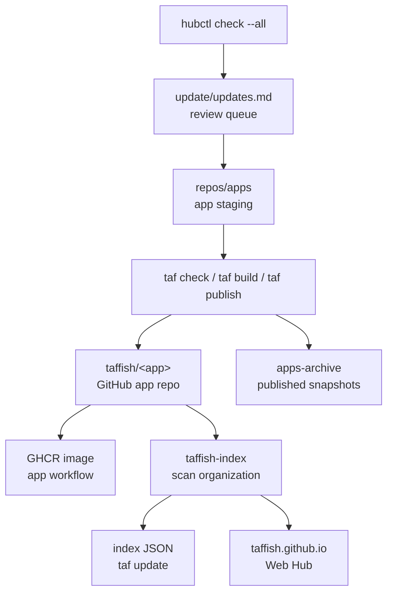

# taffish-hub 架构

本页记录 `taffish-hub` 作为 TAFFISH 生态本地工厂的结构和职责。它解释 `taffish-hub` 如何组织 app 工作树、公开仓库源码、index、Web Hub、文档、官网、upstream 更新队列和归档快照。

`taffish-hub` 不是用户本地 TAFFISH home，也不是独立后端服务器。它是维护者侧工作区：先在本地把所有 GitHub-facing 仓库和 app 版本整理到可复现状态，再发布到 `taffish` GitHub organization，并最终被 `taffish-index` 和用户侧 `taf` 消费。

## 与其他文档的关系

| 文档 | 关注点 |
| --- | --- |
| [GitHub 组织架构](github-organization.md) | `taffish`、`taffish-org`、GHCR 和组织内仓库职责。 |
| [自动化流水线架构](automation-pipelines.md) | app image、index、Web Hub、Gitee mirror、hubctl 的自动化边界。 |
| [app 发布生命周期](app-release-lifecycle.md) | 单个 app 从创建到用户可安装的状态推进。 |

本页关注 `taffish-hub/` 这个本地工作区本身：哪些目录存在、每个目录承担什么角色、哪些东西可以发布、哪些只是维护者内部状态。

## 核心定位

`taffish-hub` 的核心定位是：

```text
local factory for TAFFISH GitHub repositories
```

这句话有三层含义：

1. `repos/<name>/` 下的目录应能成为独立 GitHub 仓库根目录。
2. `repos/apps/` 下的 app 工作树最终应发布为 `taffish/<app>` 仓库。
3. `update/`、`apps-archive/`、`hubctl/` 等目录是维护者侧控制面，不直接成为用户安装来源。

因此，`taffish-hub` 不是一个需要用户安装的 Hub 后端。它的输出物才是用户看到的东西：GitHub app 仓库、`taffish-index` 静态 JSON、`taffish.github.io` 网页、`taffish-docs` 文档和可选的 `taffish.com` 官网。

## 当前工作区布局

当前 `taffish-hub` 工作区大致是：

```text
taffish-hub/
  taffish-hub.toml
  README.md
  docs/
  repos/
    README.md
    .github/
    taffish-index/
    taffish.github.io/
    taffish-docs/
    apps/
      README.md
      bio/
        tools/
          augustus/
          autodock-vina/
  apps-archive/
    README.md
  update/
    README.md
    updates.md
    archive/
  hubctl/
    README.md
    src/
    scripts/
    target/
  taffish.com/
    README.md
    public/
    notes/
```

`taffish-hub.toml` 是工作区锚点：

```toml
[hub]
name = "taffish-hub"

[paths]
repos_apps = "repos/apps"
apps_archive = "apps-archive"
update = "update"
```

`hubctl` 会通过它识别 Hub 根目录，并定位 app staging、归档和更新队列。

## 目录职责

| 目录 | 角色 | 是否发布给用户 |
| --- | --- | --- |
| `repos/` | GitHub-facing 仓库源码区 | 子目录会分别发布。 |
| `repos/apps/` | taf-app staging 区 | app 子目录会发布为独立 app 仓库。 |
| `repos/taffish-index/` | 静态 index 仓库源码 | 发布为 `taffish/taffish-index`。 |
| `repos/taffish.github.io/` | Web Hub 源码 | 发布为 `taffish/taffish.github.io`。 |
| `repos/.github/` | GitHub organization profile | 发布为 `taffish/.github`。 |
| `repos/taffish-docs/` | 公开文档仓库源码 | 发布为 `taffish/taffish-docs`。 |
| `docs/` | Hub 工作区内文档源 | 迁移期可作为文档源，最终应与 `taffish-docs` 收敛。 |
| `taffish.com/` | 官方主页工作区 | `public/` 可部署到 `taffish.com`。 |
| `apps-archive/` | 已发布 app 快照归档 | 不直接发布，维护者记录。 |
| `update/` | upstream 更新队列 | 不直接发布，维护者记录。 |
| `hubctl/` | Hub 控制工具源码和构建产物 | 维护者侧工具。 |

其中最需要注意的是 `repos/apps/`：它不是一个要发布为 `taffish/apps` 的仓库。它是 app 工作树的 staging 区。里面每个 app 才应发布为自己的 GitHub 仓库。

## repos：GitHub-facing 仓库区

`repos/` 下的直接子目录通常对应一个 GitHub 仓库：

```text
repos/taffish-index       -> github.com/taffish/taffish-index
repos/taffish.github.io   -> github.com/taffish/taffish.github.io
repos/.github             -> github.com/taffish/.github
repos/taffish-docs        -> github.com/taffish/taffish-docs
```

规则：

1. 目录名应尽量等于目标 GitHub repository name。
2. 每个子目录应能作为独立 repository root 使用。
3. 每个子目录自己的 `.git`、README、workflow 和发布节奏相互独立。
4. `repos/` 本身是本地集合，不是最终用户消费的仓库。

这种布局让维护者可以在一个工作区里同时管理多个公开仓库，但仍保留每个仓库的独立性。

## repos/apps：app staging 区

`repos/apps/` 用于放置正在迁移、开发或维护的 taf-app 工作树。

当前可按领域和类别分层，例如：

```text
repos/apps/
  bio/
    tools/
      augustus/
      autodock-vina/
```

这个分层是维护者本地组织方式，不是 canonical repository path。发布到 GitHub 后，app 的 canonical 身份仍然应是：

```text
github.com/taffish/<app>
```

而不是：

```text
github.com/taffish/bio/tools/<app>
```

每个 app 工作树应保持普通 TAFFISH app 项目结构：

```text
<app>/
  taffish.toml
  src/main.taf
  docs/help.md
  README.md
  LICENSE
  docker/Dockerfile
  .github/workflows/build-image.yml
```

维护者在这里完成：

1. `taf new` 或迁移旧 app。
2. 编辑 `taffish.toml`、`.taf`、Dockerfile、帮助文档和 meta/upstream 元数据。
3. `taf check`、`taf run`、`taf build`、必要的科学 smoke test。
4. `taf publish --release --dry-run`。
5. `taf publish --release --yes --build`。
6. 发布后复制快照到 `apps-archive/`。

`hubctl check --all` 会递归扫描这个目录下的 `taffish.toml`。

## apps-archive：发布快照归档

`apps-archive/` 保存已发布 app 版本的维护者侧快照。建议结构是：

```text
apps-archive/
  taf-example/
    versions/
      1.2.3/
        r1/
          taffish.toml
          src/
          docker/
          README.md
```

它的作用是：

1. 给维护者保留本地发布记录。
2. 方便以后比较同一个 app 的多个 release。
3. 方便 upstream 更新时查看上一次打包方式。
4. 方便在 hub 工作区内做批量审查。

它不是 canonical source。公开 source 仍然是 GitHub app 仓库和 release tag。不要让 `apps-archive/` 变成第二套发布源。

## update：维护队列

`update/` 保存 `hubctl` 生成的 upstream 检测报告。

核心文件：

```text
update/updates.md
```

`hubctl check --all` 会追加 dated scan batch。开放事项用 `[?]` 标记。维护者完成迁移、测试、发布和归档后，再把事项标记为 `[x]`。

当前语义：

1. `updates.md` 是人工 review 队列，不是自动发布指令。
2. 未完成的 `[?]` 存在时，`hubctl` 不应继续追加新 batch。
3. `update/archive/` 可以用于放旧报告或迁移后的历史记录。

这个设计避免 upstream 检测把维护者淹没在重复报告里。TAFFISH app 的升级仍然需要人工判断：上游版本是否可靠、许可证是否变化、参数是否兼容、镜像是否可构建、科学结果是否合理。

## hubctl：维护者控制工具

`hubctl/` 是 TAFFISH Hub 的维护者侧自动化工具。

它当前刻意只做一件事：

```sh
hubctl/target/hubctl check --all
```

它会：

1. 通过 `taffish-hub.toml` 找到 Hub 根目录。
2. 扫描 `repos/apps/` 下的 app。
3. 读取每个 app 的 `[package]` 和 `[upstream]`。
4. 用 `git ls-remote` 检查 upstream GitHub tags。
5. 把结果写入或展示为 `update/updates.md`。

它不做这些事：

1. 不编辑 app。
2. 不构建 Docker 镜像。
3. 不发布 GitHub 仓库。
4. 不创建 GitHub Release。
5. 不归档 app snapshot。
6. 不同步 Gitee mirror。

这个边界非常重要。`hubctl` 是提醒和队列工具，不是自动迁移系统。未来可以扩展半自动化能力，但每一步都应保留 review gate。

## taffish-index：静态索引仓库

`repos/taffish-index/` 是 `taffish-index` 仓库源码。它负责把 GitHub 上的 app 仓库转成用户可消费的静态 JSON。

关键文件：

```text
repos/taffish-index/
  .github/workflows/build-index.yml
  scripts/build-index.lisp
  src/
  index/
    index.json
    packages/
    commands/
```

它的工作方式：

1. GitHub Actions 手动或每日定时运行。
2. 安装 SBCL。
3. 执行 `scripts/build-index.lisp`。
4. 扫描 `taffish` GitHub organization。
5. 校验 app 元数据和 release tag。
6. 写入 `index/`。
7. 如果生成文件变化，则 commit 并 push。

本地测试可以用 `--local-repo` 扫描 staging app，但正式 index 应以 GitHub organization 和 release tag 为来源。

`taffish-index` 不负责构建容器镜像。它只读取 app 声明的 container metadata，并写入 index。

## taffish.github.io：Web Hub

`repos/taffish.github.io/` 是网页 Hub 源码。它从 `taffish-index` 读取静态 JSON：

```text
https://raw.githubusercontent.com/taffish/taffish-index/main/index/index.json
```

它提供：

1. app 搜索和筛选。
2. tool / flow 分类。
3. package 详情。
4. version 列表。
5. dependencies、platform、container、meta、upstream 展示。
6. install 命令复制。
7. index warnings 展示。

它是展示层，不是 CLI 的必要运行条件。即使网页出问题，只要 `taffish-index` 可用，用户仍可以通过 `taf update` 和 `taf install` 使用 app。

## taffish-docs：公开文档仓库

`repos/taffish-docs/` 是面向公开用户、app 作者和 Hub 维护者的文档仓库。

它和 TAFFISH 主项目源码文档 `docs/` 的区别是：

| 位置 | 面向对象 | 内容边界 |
| --- | --- | --- |
| `taffish/docs/` | TAFFISH 实现维护者和贡献者 | 源码树开发文档、规范草案、架构记忆。 |
| `taffish-hub/repos/taffish-docs/` | 公开用户和 app 作者 | 快速开始、语言教程、app 开发指南、公开规范、故障排查。 |
| `taffish-hub/docs/` | hub 工作区文档源 | 迁移期文档集合，可向 `taffish-docs` 收敛。 |

长期看，公开可读的用户和 app 作者文档应以 `taffish-docs` 为准；TAFFISH 主仓库 docs 应把实现、架构和治理记忆保留在源码附近。

## .github：组织首页

`repos/.github/` 发布为：

```text
github.com/taffish/.github
```

GitHub 会把：

```text
profile/README.md
```

展示在：

```text
https://github.com/taffish
```

它适合放：

1. TAFFISH 项目一句话定位。
2. 安装入口。
3. Hub 和文档入口。
4. `taffish-index` 和 app 生态入口。
5. 当前状态说明。

组织首页不应承载过多教程细节。教程应放在 `taffish-docs`，app 浏览应放在 `taffish.github.io`。

## taffish.com：官方主页工作区

`taffish.com/` 是官方项目主页工作区。当前它是静态站点：

```text
taffish.com/
  public/
    index.html
    assets/
  notes/
```

职责区分：

| 站点 | 角色 |
| --- | --- |
| `taffish.com` | 项目主页和稳定公共入口。 |
| `taffish.github.io` | app registry / Web Hub。 |
| `github.com/taffish` | 开发者和源码入口。 |
| `taffish/taffish-docs` | 文档入口。 |

`public/` 可以部署到官网 hosting root；`notes/` 是维护者草稿和部署记录，不应上传到公开站点。

## 维护数据流

从维护者视角看，`taffish-hub` 的核心数据流是：



这个流程中，只有 `taffish/<app>`、GHCR、`taffish-index` 和 Web Hub 是用户可见路径。`repos/apps`、`update/` 和 `apps-archive/` 是维护者侧路径。

## 当前自动化边界

当前 `taffish-hub` 已经具备这些自动化或半自动化能力：

| 能力 | 当前形式 |
| --- | --- |
| app 项目骨架 | 由 TAFFISH 主项目 `taf new` 生成。 |
| app 发布 | 由 `taf publish` 调用 git/gh 完成。 |
| app 镜像构建 | 由每个 app 仓库自己的 GitHub Actions 完成。 |
| index 生成 | 由 `taffish-index` GitHub Actions 完成。 |
| upstream 检测 | 由本地 `hubctl check --all` 完成。 |
| Web Hub 展示 | 由 `taffish.github.io` 读取静态 index 完成。 |

仍然是人工维护者工作的部分：

1. app migration。
2. 科学有效性检查。
3. Dockerfile 修复和镜像调试。
4. 发布前 review。
5. GHCR visibility 检查。
6. archive snapshot。
7. Gitee mirror 同步。
8. upstream 更新是否应该接受。

这是合理的。早期 TAFFISH Hub 的重点不是把所有生信维护工作无人化，而是把可机械化的部分固定成可靠轨道，把需要判断的部分留给维护者。

## 与用户侧 taf 的边界

用户侧 `taf` 不读取 `taffish-hub/` 工作区。用户只关心：

1. `taf update` 能下载 index。
2. `taf search` / `taf info` 能查询本地 index。
3. `taf install` 能 clone app source ref。
4. 安装后的 command 能构建并运行。
5. 容器化 app 的 image 能被本机 runtime 拉取。

因此，`taffish-hub` 里的 staging、archive、update queue 和 hubctl 都不应泄漏成用户必须理解的概念。它们服务维护者，而不是用户。

## 迁移期建议

在 `taffish-hub` 继续迁移时，建议保持这些规则：

1. 每新增一个 publishable repo，就放到 `repos/<repo-name>/`，并确保它能独立发布。
2. 每迁移一个 app，就先放到 `repos/apps/<domain>/<kind>/<app>/`，但 `taffish.toml` 的 repository URL 仍指向 `https://github.com/taffish/<app>`。
3. app 发布后，把快照复制到 `apps-archive/<app>/versions/<version>/r<release>/`。
4. 每次 upstream 检测只生成 queue，不直接修改 app。
5. `taffish-index` 只索引 canonical GitHub 状态，不索引 staging 工作树作为正式来源。
6. `taffish.github.io` 只展示 index，不维护自己的 app 列表。
7. `taffish-docs` 和 `docs/` 的重复内容应逐步收敛，避免长期分叉。
8. `taffish.com` 保持为官网入口，不承担 app registry 职责。

## 维护检查清单

修改 `taffish-hub` 结构时，应检查：

1. `taffish-hub.toml` 中的路径是否仍正确。
2. `hubctl check --all` 是否仍能找到 `repos/apps`。
3. `apps-archive/` 是否仍只保存发布快照，不成为 source of truth。
4. `update/updates.md` 是否仍是人工 review queue。
5. `repos/<name>` 是否仍能独立作为 GitHub repo root。
6. `taffish-index` 是否仍扫描 GitHub organization，而不是本地 staging 作为正式来源。
7. `taffish.github.io` 是否仍从 `taffish-index` 读取 index。
8. `taffish-docs` 是否和公开文档入口一致。
9. `taffish.com/public` 是否只包含可公开部署内容。
